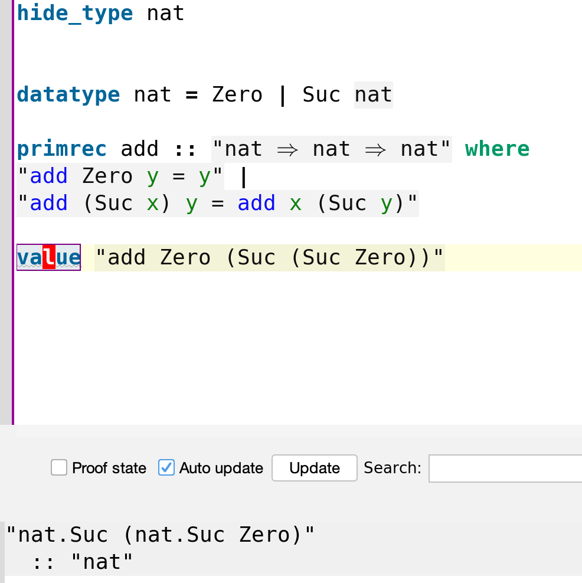
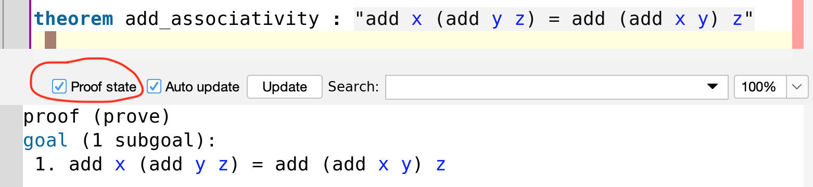
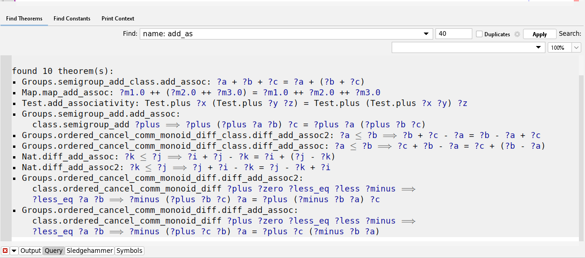
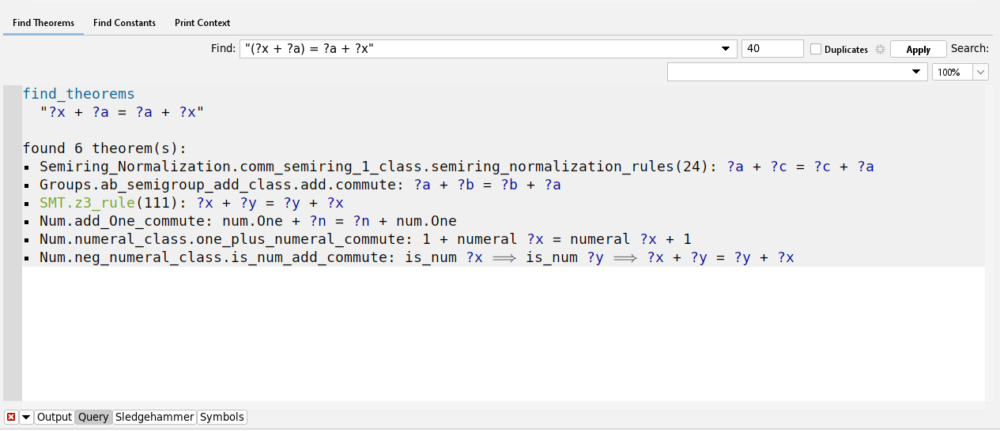
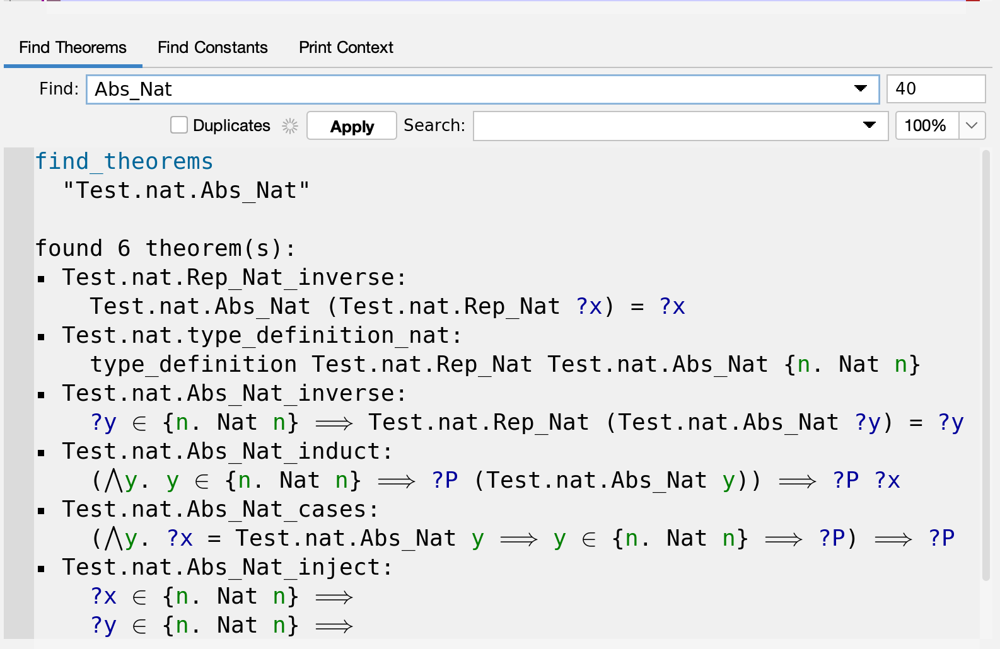
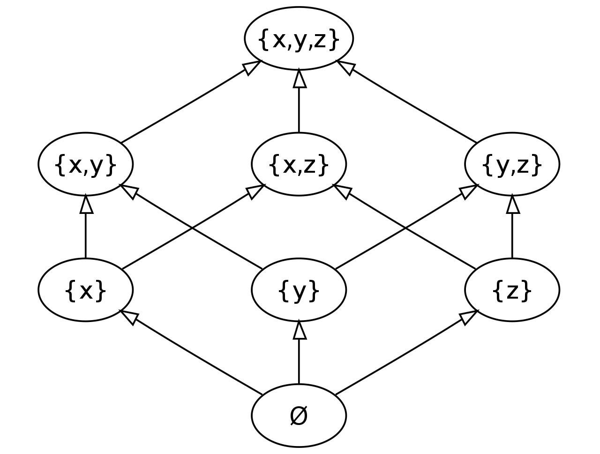
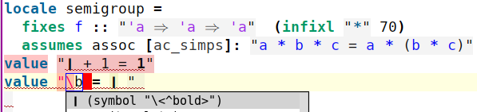

# Fundamentals of Isabelle {#fundamentals-of-isabelle}


Let's start by creating a file `Playground.thy`
with the following contents

```
theory Playground
imports Main
begin
(* here we will write our code*)
end
```
We can use `(* *)` as comments. Those are ignored by Isabelle.

## Inductive data types

The set of natural numbers `nat` is defined inductively as

```
hide_type nat (* use this line to avoid conflicst with Main library *)

datatype nat = Zero | Suc nat
```

(This is not actual definition of `nat`)

We can represent `0` as `Zero`, number `1` as `Suc Zero`, number `2` as `Suc (Suc Zero)` and so on. This is widely known as [Peano arithmetic](https://en.wikipedia.org/wiki/Peano_axioms).  

## Functions {#primrec-functions}

Functions can be defined usig `primrec`. For example addition can be introduced as the follows

```
primrec plus :: "nat ⇒ nat ⇒ nat" where
"plus Zero y = y" |
"plus (Suc x) y = Suc (plus x y)"
```
Isabelle uses `⇒` (written as `=>` in ASCII) to denote the type of functions. If `x` and `y` are types then `x ⇒ y` is a function type (`⇒` has [left associativity](https://en.wikipedia.org/wiki/Operator_associativity)). Such mathematical expressions must be enclosed in double quotes `" "`. After the type comes `where` keyword which marks the beginning of function **specification** (this is not function *definition*! You'll see later). Our function has two cases separated by `|`.
 The first case applies when the first argument is `Zero`. You can test it with the `value` command, for example `0+2` is

```
value "plus Zero (Suc (Suc Zero))"
```


The second case applies when the first argument is a successor `Suc x` of some number `x`. For example `1+2` outputs `3` as follows

```
value "plus (Suc Zero) (Suc (Suc Zero))" (* this prints "nat.Suc (nat.Suc (nat.Suc Zero))" *)
```


The functions `Zero` and `Suc` are called constructors. Their types are `nat`and `nat ⇒ nat` which you can check using `value`

```
value "Suc" (* this prints "nat ⇒ nat" *)
value "Zero" (* and this prints "nat" *)
```
All inductive types (`datatype`) have some size. The `size` tells us how deep the recursion is. For example

```
value "size Zero"  (* prints "0" *)
value "size (Suc Zero)" (* prints "1" *)
value "size (Suc (Suc Zero))" (* prints "2" *)
```
A constructor can take more than one argument   

```

datatype x = X1 | X2 x | X3 x x

value "size X1" (* prints "0" *)
value "size (X2 X1)" (* prints "1" *)
value "size (X3 X1 X1)" (* still prints "1" *)
value "size (X3 X1 (X2 X1))" (* now prints "2" *)

```
The value of `size` is always a finite number, which brings us to 
primitive recursion. 

## Primitive recursion

In Isabelle all functions must terminate. For example the following is illegal
```
primrec f :: "nat ⇒ nat" where
"f x = f x"
```
because the evaluation of `f` would never end. The reason why we don't want that is because it would allow us to prove any statement about `f` to be true (proofs by induction will be shown soon). 

To avoid such problems `primrec` must be a [primitive recursive function](https://en.wikipedia.org/wiki/Primitive_recursive_function). Those functions must be of the form

```
datatype x = X1 a | X2 b | ... Xn c
primrec f :: "x ⇒ y" where
"f (X1 a) = ... f a ..." |
"f (X2 b) = ... f b ..." |
... |
"f (Xn c) = ... f c ..." 
```
which means that they consider all cases (`X1 a`, `X1 b`, ... `Xn c`) of some inductive type `x` and can only perform recursion (e.g. `f a`) on constructor parameters but not on the original input (e.g. `f (X1 a)` not allowed on the right side). This means that the `size` of first argument always decreases and because it is finite and non-negative it must eventually reach `0` and end. 

Primitive recursive functions are very limiting and not [Turing-complete](https://en.wikipedia.org/wiki/Turing_completeness), therefore, if `primrec` is not enough, we can use `fun` but we may have to provide our own proof that the recursion  always ends (`fun` will be shown later).

## Theorems and proofs

To write proofs we can use `theorem` keyword. For example let's write proof that addition is associative, that is, `x+(y+z)=(x+y)+z` for all natural numers `x,y,z`

```
theorem add_associativity : "plus x (plus y z) = plus (plus x y) z" 
```
If you place your cursor below the theorem and toggle the "Proof state" button you will see the state of your proof



When dealing with inductive types a good idea is to prove theorems by induction. This is done with `apply(induct_tac x)` tactic.

```
theorem add_associativity : "plus x (plus y z) = plus (plus x y) z" 
  apply(induct_tac x)
```
Now the state of the proof becomes

```
proof (prove)
goal (2 subgoals):
 1. plus Zero (plus y z) = plus (plus Zero y) z
 2. ⋀x. plus x (plus y z) = plus (plus x y) z ⟹
         plus (Suc x) (plus y z) = plus (plus (Suc x) y) z
```
We have two subgoals. First one is to prove that initial condition for `Zero`, second is to prove recursive case while having access to  inductive hypothesis `plus x (plus y z) = plus (plus x y) z`. The long double arrow `⟹` (written `==>` in ASCII) is the logical implication.
Symbol `⋀` is the universal quantifier "for all x". The goals we have now could be simplified. Isabelle can do a lot of the leg work automatically by using `apply(auto)` tactic.

```
theorem add_associativity : "plus x (plus y z) = plus (plus x y) z" 
  apply(induct_tac x)
   apply(auto)
  done
```
Now all the goals are proved

```
proof (prove)
goal:
No subgoals!
```
and we can add `done` to finish the theorem. 

### Querying and using proofs {#query-proofs}

If you ever forget what the theorem states, you can use command `thm` to look it up

```
thm add_associativity
```

which prints

```
plus ?x (plus ?y ?z) = plus (plus ?x ?y) ?z
```

Isabelle has added `?` to all variables, which means that from now on you can substitute
those variables for an arbitrary expression like this

```
theorem zero_plus_one_plus_z: "plus Zero (plus (Suc Zero)  z) = plus (plus Zero (Suc Zero)) z"
  apply(subst add_associativity)
  apply(rule refl)
  done
```

The `subst` command will look for any pattern that looks like `plus ?x (plus ?y ?z)` and substitute
it for `plus (plus ?x ?y) ?z`. In this case `?x` matches with `Zero`, `?y` matches `Suc Zero` and `?z` matches `z`.

If you are curious what `refl` does you can look it up in the same way

```
thm refl
```

which prints

```
?t = ?t
```

You can hold `Ctrl` (or `Cmd` on OSX) and click on any term to go to its definition. Click on `refl`
and you will be redirected to a file from Isabelle's `Main` library, to the exact line that defines `refl`

```
subsubsection ‹Axioms and basic definitions›

axiomatization where
  refl: "t = (t::'a)" and 
  subst: "s = t ⟹ P s ⟹ P t" and
  ext: "(⋀x::'a. (f x ::'b) = g x) ⟹ (λx. f x) = (λx. g x)"
    ― ‹Extensionality is built into the meta-logic, and this rule expresses
         a related property.  It is an eta-expanded version of the traditional
         rule, and similar to the ABS rule of HOL› and

  the_eq_trivial: "(THE x. x = a) = (a::'a)"
```

The proof of `zero_plus_one_plus_z` could be written more compactly as

```
theorem t: "plus Zero (plus (Suc Zero)  z) = plus (plus Zero (Suc Zero)) z"
  apply(rule add_associativity)
  done
```

Here, instead of substituting left side for the right side and then applying equality rule `refl`,
we apply the `add_associativity` directly. If both left and right sides of equation match then it is obvious that they are equal and the proof is done.

These examples show how we can use previous theorems to prove new ones. The `Main` library contains a galore of
theorems to choose from. You can search for proofs by name



or by pattern involving wildcards `_`


or by pattern involving `?`-prefixed variables 




### More complex proofs {#more-complex-proofs}

Here are a few more examples of easy theorems

```
theorem add_suc_rev : " plus x (Suc y) = plus (Suc x) y" 
  by(induct_tac x, auto)
  
theorem add_suc_out : "plus (Suc x) y = Suc (plus x y)" 
  by(induct_tac x, auto)
  
theorem add_zero : "plus x Zero = x" 
  by(induct_tac x, auto)
```

The `by` keyword  is a shorthand one-line notation for simple proofs and is equivalent to the multi-line proof we did before. Let's try a more complex theorem.

```
theorem add_commutativity : "plus x y = plus y x" 
  apply(induct_tac x)
  	apply(simp)
```
We start with induction and simplification but it only gets us so far

```
proof (prove)
goal (2 subgoals):
 1. y = plus y Zero
 2. ⋀x. plus x y = plus y x ⟹ Suc (plus y x) = plus y (Suc x)
```
We have already proved the first subgoal in form of `add_zero` theorem. We can tell Isabelle to use it by using `simp add: add_zero`.

```
theorem add_commutativity : "plus x y = plus y x" 
  apply(induct_tac x)
   apply(simp add:add_zero)
```
This solves the first subgoal

```
proof (prove)
goal (1 subgoal):
 1. ⋀x. plus x y = plus y x ⟹ plus (Suc x) y = plus y (Suc x)
```

The tactic `simp` is similar to `auto` but it only applies to a single subgoal and can be extended in many ways (like with `add:`) that `auto` cannot. `auto` uses more heuristics and can solve more problems out-of-the-box. `simp` gives more control to us. Now, to solve the remaining subgoal, not even `simp` is detailed enough. We will have to tell Isabelle which substitution rules to use exactly (`simp` and `auto` do this behind the scenes). We want to apply `apply(subst add_suc_rev)`

```
proof (prove)
goal (1 subgoal):
 1. ⋀x. plus x y = plus y x ⟹ plus (Suc x) y = plus (Suc y) x
```

and then `apply(subst add_suc_out)`

```
proof (prove)
goal (1 subgoal):
 1. ⋀x. plus x y = plus y x ⟹ Suc (plus x y) = plus (Suc y) x
```

and again `apply(subst add_suc_out)`

```
proof (prove)
goal (1 subgoal):
 1. ⋀x. plus x y = plus y x ⟹ Suc (plus x y) = Suc (plus y x)
```

then we finish off with `apply(simp)`. The full proof looks as follows

```
theorem add_commutativity : "plus x y = plus y x" 
  apply(induct_tac x)
   apply(simp add:add_zero)
  apply(subst add_suc_rev)
  apply(subst add_suc_out)
  apply(subst add_suc_out)
  apply(simp)
  done
```

### The thinking process 
You might be wondering how I arrived at this proof. In fact, I started from the end. My initial goal was to prove `add_commutativity` but I couldn't. Whenever you're stuck in Isabelle, it's always a good idea to backtrack and try to prove something simpler first. I tried proving all the smaller auxiliary theorems like `add_suc_out` first. Even those were difficult because initially my definition of `plus` looked like this

```
primrec plus :: "nat ⇒ nat ⇒ nat" where
"plus Zero y = y" |
"plus (Suc x) y = plus x (Suc y)" (* Suc applied to y! *)
```
Only after changing the definition to `Suc (plus x y)` all of the theorems became much easier to prove. This is something you will see often when working with Isabelle or any other proof assistant. There are many equivalent definitions but some are more elegant than others.

## Inductive predicates

Data types are limited to representing finite entities. For example we can use `lists` to store a finite number of even numbers

```
value "[0::Nat.nat,2,4,6]"
(* it prints
"[0, 2, 4, 6]"
  :: "Nat.nat list"  <- notice Nat.nat comes from the imported Main. It's not our own definition.
*)
```
In many programming languages we can also use hash-maps to do something like

```
# This is Python code
is_even = {
 0 : True,
 1 : False,
 2 : True,
 3 : False,
 4 : True
}
```

The problem with data types is that they cannot store infinite sets. We could turn the hash-map `is_even` into a function instead

```
datatype nat = Zero | Suc nat 

fun is_even :: "nat ⇒ bool" where 
"is_even Zero = True" |
"is_even (Suc Zero) = False" |
"is_even (Suc(Suc n)) = is_even n"
```

Now calling `is_even (Suc (Suc Zero))` is equivalent to looking up a hash-map in Python `is_even[2]` but we are no longer limited to finite sets. Notice that we had to use `fun` because `primrec` does not allow nested patterns `is_even (Suc(Suc n))` on the left. We will investigate `fun` in depth later.

If functions are like infinite hash-maps then `inductive` predicates

```
inductive Even :: "nat ⇒ bool" where
zero: "Even Zero"
| double: "Even (Suc (Suc n))" if "Even n" for n
```

are like infinite linked lists.

While `is_even` returns `True` on numbers that are even and `False` on those that aren't, the `inductive` predicate `Even` can be proved to hold for even numbers but cannot be proved to hold for anything else. By analogy a list only contains elements that belong to it whereas a hash-map must also hold odd numbers and mark them as `False`.
Note one interesting difference between finite and infinite data structures. If you try to iterate over an entire linked-list or hash-map you will eventually reach the end. By exploiting this fact, you don't need to store `False` entries in a hash-map but this cannot be done with infinite structures. For this reason mathematicians refer to finite structures as [effective](https://en.wikipedia.org/wiki/Effective_method). 

To prove that `4` is even we can proceed as follows

```
theorem "Even (Suc (Suc (Suc (Suc Zero))))"
  apply(rule double)
  apply(rule double)
  apply(rule zero)
  done
```

We can also prove that `is_even x` is true only when `Even x` holds 

```
theorem "Even m ⟹ is_even m" 
  apply(induction rule: Even.induct)
  by(simp_all)
```
The long arrow `⟹` is logical implication (written `==>` in ASCII).

The tactic `apply(induction rule: Even.induct)` says that we want to prove the theorem by induction and yields the following two subgoals. 

```
 1. is_even Zero
 2. ⋀n. Even n ⟹ is_even n ⟹ is_even (nat.Suc (nat.Suc n))
```

Those are then easy to prove using `apply(rule double)` and `apply(rule zero)` so we just let Isabelle do the rest automatically by calling `by(simp_all)`. 

### When to use inductive over recursive

If you need to prove statements about the negative cases (here those would be odd numbers) then working with recursive functions is easier.
On the other hand if you do not care about negative cases and only want to prove statements about positive ones (even numbers) then `inductive` definitions often yield simpler proofs. 

In some cases it is impossible to give recursive definitions. In particular those are problems that are [not decidable](https://en.wikipedia.org/wiki/Decidability). Then our only option is to use `inductive` definitions (which is related to [semi-decidability](https://en.wikipedia.org/wiki/Decidability_(logic)#Semidecidability)).

## Type declarations and axiomatization 

### Sets {#set-def}

We can declare a new type without providing any definition. This is done with `typedecl` keyword. Of course such types are not very useful on their own so they are typically combined with some `axiomatization`. For example the following is how Isabelle defines sets

```
typedecl 'a set

axiomatization Collect :: "('a ⇒ bool) ⇒ 'a set" ― ‹comprehension›
  and member :: "'a ⇒ 'a set ⇒ bool" ― ‹membership›
  where mem_Collect_eq [iff, code_unfold]: "member a (Collect P) = P a"
    and Collect_mem_eq [simp]: "Collect (λx. member x A) = A"
```

The apostrophe in front of `'a` is a special notation that indicates that `a` is not any specific type. Instead `'a` can be substituted for any other concrete type. It works like a wildcard or like generic types in many programming languages.

We do not know anything about `'a set` other than that it can be created with function `Collect` and that its members can be queried with `member`. We know that those two functions are "inverse" of each other which more precisely expressed by axioms `mem_Collect_eq` and `Collect_mem_eq`. We can use those two facts like we would use any other theorem. Axioms are theorems that we assume to be true without giving any proofs. We also do not need to provide definitions for `Collect` and `member`. They are like "interface" functions in some programming languages.

We introduce notation 

```
notation
  member  ("'(∈')") and
  member  ("(_/ ∈ _)" [51, 51] 50)
```

so that we can write `x ∈ X` instead of `member x X`. There is also nice syntax for set comprehension

```
syntax
  "_Coll" :: "pttrn ⇒ bool ⇒ 'a set"    ("(1{_./ _})")
translations
  "{x. P}" ⇌ "CONST Collect (λx. P)"
```

so that we can write `{x . P x}` instead of `Collect P` for some predicate `P`. We will investigate `syntax` and `notation` later. Their only purpose is to make things more readable.


### Natural numbers {#ordinals}

The previous definition of natural numbers `nat` was simplified. The one actually provided by Isabelle is more complicated. Before we can see it we have to first declare `ind` but instead of definining it, we only state its axioms

```
typedecl ind

axiomatization Zero_Rep :: ind and Suc_Rep :: "ind ⇒ ind"
  ― ‹The axiom of infinity in 2 parts:›
  where Suc_Rep_inject: "Suc_Rep x = Suc_Rep y ⟹ x = y"
    and Suc_Rep_not_Zero_Rep: "Suc_Rep x ≠ Zero_Rep"

```

Notice that `ind` behaves just like `nat` but unlike `Suc`, the `Suc_Rep_inject` might be applied infinitely. It is possible to use `ind` to express infinity `∞` (this is [what `codatatype` is for](https://en.wikipedia.org/wiki/Coinduction)) but `nat` could never do that (due to `size`).

Nonetheless, most of the time we **want** to work with finite numbers. For this purpose we define predicate `Nat` that includes only finite elements of `ind`

```
inductive Nat :: "ind ⇒ bool"
  where
    Zero_RepI: "Nat Zero_Rep"
  | Suc_RepI: "Nat i ⟹ Nat (Suc_Rep i)"
```


Now the real definition of `nat` is a subset of `ind set` that consists of only finite numbers `Nat`. 

```
typedef nat = "{n. Nat n}"
  morphisms Rep_Nat Abs_Nat
  using Nat.Zero_RepI by auto
```
Infinite numbers, known as [ordinals](https://en.wikipedia.org/wiki/Ordinal_number), will be covered later. The meaning of `morphisms` will be explained soon but it's not important at this point.


### All types are inhabited {#undefined}

Another important example of an axiom is

```
axiomatization undefined :: 'a
```
Other proof assistants such as Coq, Agda, Lean, etc. are based on constructive logic and in particular homotopy type theory. In those logics it is possible for a type to be empty. It is usually known as `False` or `Void` and it used to express negation. 

Isabelle is based on higher-order-logic. It can use law of excluded middle and negation out-of-the-box. As empty types are not needed anymore, Isabelle is free to assume axioms such as `undefined`. It states that every type `'a` has some inhabitant. Note that `'` is used to indicate a type variable, which we can substitue for any concrete type like `undefined::nat`.

This axiom allows us to prove things like


```
datatype bool = True | False

lemma "undefined = True ∨ undefined = False" 
  apply(case_tac "undefined::bool") 
  apply(rule disjI1)
  apply(simp)
  apply(rule disjI2)
  apply(simp)
  done
```

The tactic `apply(case_tac "undefined::bool")` tries to consider all possible cases in which something of type `bool` could be defined. `undefined` must be either `undefined = bool.True` or `undefined = bool.False`, and in both of those cases the theorem should hold. Hence, we have two subgoals

```
 1. undefined = bool.True ⟹
    undefined = bool.True ∨ undefined = bool.False
 2. undefined = bool.False ⟹
    undefined = bool.True ∨ undefined = bool.False
```
The tactic `apply(rule disjI1)` is the first (`1`) introduction (`I`) rule for disjunction (`dist`). It says that if `P` is true then `P ∨ Q` is true. Analogically `apply(rule disjI2)` says that if `Q` is true then `P ∨ Q` is true. After applying `apply(rule disjI1)` we arrive at

```
 1. undefined = bool.True ⟹ undefined = bool.True
 2. undefined = bool.False ⟹
    undefined = bool.True ∨ undefined = bool.False
```
The equality in first subgoal is trivial so we can just use `apply(simp)` to automatically simplify it. We then proceed analogically with the second subgoal.

The `undefined` axiom has some major implications which will manifest themselves later. [Here](https://www.joachim-breitner.de/blog/732-Isabelle_functions__Always_total,_sometimes_undefined) is more on this topic as well.

*Most importantly*, you should be aware that `∀𝑥. 𝑃 𝑥 → ∃𝑥. 𝑃 𝑥` is a valid first-order logic sentence. This is known as [ontological commitment](https://plato.stanford.edu/entries/ontological-commitment/) and is also explained [here](https://math.stackexchange.com/questions/1297521/for-all-x-px-implies-there-exists-x-px). Isabelle is based on first-order logic (actually higher-order logic) and commits to this law, therefore, it is [sound](https://en.wikipedia.org/wiki/Soundness) to assume such an axiom as `undefined`. 


## Meta logic {#meta-logic}

### Meta universal quantifier

Isabelle has a meta language. You could have seen it before in form of the `⋀` symbol (written `\And` in ASCII) which works like `∀` (written `\forall` in ASCII). The difference is that `∀` is a constructed function that we imported from Isabelle's Main library

```
definition All :: "('a ⇒ bool) ⇒ bool"  (binder "∀" 10)
  where "All P ≡ (P = (λx. True))"
```

whereas `⋀` does not have any definition and is fundamental part Isabelle proof assistant itself. For example when proving something that involves `∀` weh have to use `allI` rule 

```
theorem t: "∀ x. P x"
  apply(rule allI)
```
which produces a goal

```
1. ⋀x. P x
```
You should understand it as follows. In order to prove that `P` holds for all `∀x`, Isabelle fixes an arbitrary `⋀x`. If you can prove `P x` for an arbitrary `x` then `P` must hold for all `x`. You can use tacticts such as `induct_tac x` on variables bound by `⋀`. For example

```
theorem t: "∀ x::nat. P x"
  apply(rule allI)
  apply(induct_tac x)
```
yields 2 subgoalds

```
 1. ⋀x. P 0
 2. ⋀x n. P n ⟹ P (Suc n)
```
However, if you tried to use `induct_tac x` directly when `x` is bound to `∀` you will get an error

```
theorem t: "∀ x::nat. P x"
  apply(induct_tac x) (*Error:  No such variable in subgoal: "x" *)
```

### Meta implication

There is a similar difference between logical implication `⟶` (written as `-->`) and meta-logic implication `⟹` (`==>`). For example

```
theorem t: "P x ⟶ Q x"
  apply(rule impI)
```

yields subgoal

```
1. P x ⟹ Q x
```

and now we can use `P x` as an assumption when proving `Q x`. For instance to prove that `P x ⟶ P x` we can write

```
theorem t: "P x ⟶ P x"
  apply(rule impI)
  apply(assumption)
  done
```

### Meta equality

Lastly there is logical equality `=` and meta-equality `≡` (`==`). You can use `using [[simp_trace]]` to see a detailed trace of what `simp` is doing behind the scenes 

```
theorem t: "x = y ⟹ y = x"
  using [[simp_trace]]
  apply(simp)
```
and you can see that the automatic simplifier tries to explore different possible assignments `≡` of variables (I added my comments after `#`)

```
[1]SIMPLIFIER INVOKED ON THE FOLLOWING TERM:
x = y ⟹ y = x 
[1]Adding rewrite rule "??.unknown":
x ≡ y 
[1]Applying instance of rewrite rule "??.unknown":
x ≡ y 
[1]Rewriting:
x ≡ y 
[1]Applying instance of rewrite rule "HOL.simp_thms_6":
?x1 = ?x1 ≡ True 
[1]Rewriting:
y = y ≡ True 
[1]Applying instance of rewrite rule "HOL.implies_True_equals":
(PROP ?P ⟹ True) ≡ True 
[1]Rewriting:
(x = y ⟹ True) ≡ True
```

Meta equality is also used for term substitution and rewriting.

## Abstraction and representation {#abstraction-and-representation}

Recall that when defining `nat` [here](#ordinals) 

```
typedef nat = "{n. Nat n}"
  morphisms Rep_Nat Abs_Nat
  using Nat.Zero_RepI by auto
```

we used `typedef` and `morphisms`. This is a fundamental mechanism for introducing new types. In fact, Isabelle's internal implementation of `datatype` command uses `typedef` behind the scene. 

You could imagine that every type in Isabelle is a set. Don't confuse it with the `'a set` type but instead think of each type as a "meta-logic set". Then `typedef` allows you to take any `'a set` (in this case `{n. Nat n}`) and produce a new meta-logic set (in this case `nat`). `typedef` also gives you two new functions - one called "representation" (`Rep_Nat`) and the other called "abstraction" (`Abs_Nat`). You can use abstraction to transform any element of `'a set` into an element of the meta-set (type of `Abs_Nat` is `{n. Nat n} => nat` and type of `Rep_Nat` is `nat => {n. Nat n}`). The two functions are inverse of one another and `typedef` will also automaticaly generate several theorems that we can use. For example

```
theorem "Abs_Nat (Rep_Nat x) = x"
  apply(rule Rep_Nat_inverse)
  done
```
The axiom `Rep_Nat_inverse` is auto-generated by `typedef`. You can find others by using search tab and typing in `Rep_Nat` or `Abs_Nat`



Lastly, every `typedef` must be finished with a proof of being inhabited. In this case the goal is

```
 1. ∃x. x ∈ {n. Nat n}
```

and is easily proved by `using Nat.Zero_RepI by auto`. The `using` keyword instructs `auto` to use a specific fact. There are millions of theorems and `auto` does not consider all of them because it would take too long. We have to explicitly allow it to use `Nat.Zero_RepI`.

If you want to better understand what `using Nat.Zero_RepI by auto` does, consider this more explicit proof

```
typedef nat = "{n. Nat n}"
  morphisms Rep_Nat Abs_Nat
  (* goal: ∃x. x ∈ {n. Nat n} *)
  apply(rule exI)  
  (* goal: ?x ∈ {n. Nat n} *)
  apply(subst Set.mem_Collect_eq)
  (* goal: Nat ?x *)
  apply(rule Nat.Zero_RepI)
  done
```
which shows that `nat` is inhabited because zero (`Nat.Zero_RepI`) belongs to it.

Recall that we have to prove that all types are inhabited because of the `undefined` axiom we discussed [previously](#all-types-are-inhabited).

### Morphisms can be omitted

The keyword `morphisms` is optional. We could have written

```
typedef nat = "{n. Nat n}"
  using Nat.Zero_RepI by auto

theorem "Abs_nat (Rep_nat x) = x"
  apply(rule Rep_nat_inverse)
  done
```
If we do not provide the names of abstraction and representation functions ourselves, `typedef` will auto-generate them for us. Their default names are dictated by the naming convention like on the example.

## Syntactic sugars and Lists {#sugars-and-lists}

Isabelle defines lists as follows.

```
(* use no_notation to avoid conflicts with list already defined in Main library *)
no_notation Nil ("[]") and Cons (infixr "#" 65) and append (infixr "@" 65)

datatype 'a list =
    Nil  ("[]")
  | Cons 'a "'a list"  (infixr "#" 65)
```

The `("[]")` introduces a pretty notation for the empty list `Nil` and `(infixr "#" 65)` is a syntactic sugar for appending to a list.
For example 

```
value " x # y # z # []" (* is of type "'a list *)
``` 

is equivalent to writing

```
value "Cons x (Cons y (Cons z Nil))"
```

The keyword `infixr` specifies associativity of the operation. Compare 

```
value " x # (y # (z # []))" (* is of type "'a list *)

value "((x # y) # z) # []" (* is of type "'a list list list *)
```

with the alternative definition that uses `infixl` instead

```
datatype 'a list =
    Nil  ("[]")
  | Cons 'a "'a list"  (infixl "#" 65)
  
value " x # y # z # []" (* is of type  "'a list list list" *)

value " x # (y # (z # []))" (* is of type "'a list" *)
``` 
Also see what happens if we now switch the order of arguments of `Cons`

```
datatype 'a list =
    Nil  ("[]")
  | Cons "'a list" 'a (infixl "#" 65)
  
value "[] # x # y # z" (* is of type  "'a list" *)

value "[] # (x # (y # z))" (* is of type "'a list list list" *)
```

From now on, let's stick to our first definition, that is `Cons 'a "'a list"  (infixr "#" 65)`.
We can make our notation even more readable by introducing a custom bracket notation

```
syntax
  "_list" :: "args => 'a list"    ("[(_)]")

translations
  "[x, xs]" == "x#[xs]"
  "[x]" == "x#[]"
```
We can now write `[x,y,z]` instead of `x # y #z # []`.
The `transaltions` will be used to automatically turn 

```
value "x # y # z # []"
```
into brackets and print the following output

```
"[x, y, z]"
  :: "'a Test.list"
```

as equivalent 
We can define list concatenation as follows.

```
primrec append :: "'a list ⇒ 'a list ⇒ 'a list" (infixr "@" 65) where
append_Nil: "[] @ ys = ys" |
append_Cons: "(x#xs) @ ys = x # xs @ ys"
```

The way `syntax` and `translations` work can be easily deduced from the example. The  `(_)` that appears in `("[(_)]")` is a wildcard that matches whatever we write between `[` and `]`. Then `translations` further work on that string and rewrite it into `#` and `[]` notation.

The infix operators can be defined for any function, not only constructors. For example 

```
primrec append :: "'a list ⇒ 'a list ⇒ 'a list" (infixr "@" 65) where
append_Nil: "[] @ ys = ys" |
append_Cons: "(x#xs) @ ys = x # xs @ ys"
```

allows us to concatenate two lists using `x @ y` instead of having to write `append x y`

```
value "[x,y] @ [z,w]"
(* prints 
"[x, y, z, w]"
  :: "'a list"
*)
```

## Type classes and semigroups {#type-classes}

### List and nat are semigroups

Very often different mathematical objects share common properties. For example compare `append` for `list` with `plus` for `nat`

```
no_notation Nil ("[]") and Cons (infixr "#" 65) and append (infixr "@" 65) and plus (infixl "+" 65) and Groups.zero_class.zero ("0")

datatype nat = Zero ("0") | Suc nat

primrec plus :: "nat ⇒ nat ⇒ nat" (infixl "+" 65) where
"0 + y = y" |
"(Suc x) + y = Suc (x + y)"

datatype 'a list =
    Nil  ("[]")
    | Cons 'a "'a list"  (infixr "#" 65)

primrec append :: "'a list ⇒ 'a list ⇒ 'a list" (infixr "@" 65) where
append_Nil: "[] @ ys = ys" |
append_Cons: "(x#xs) @ ys = x # xs @ ys"
```

It holds for both that 

```
theorem app_assoc : "x @ (y @ z) = (x @ y) @ z"
  by (induct_tac x) auto

theorem add_assoc : "x + (y + z) = (x + y) + z"
  by (induct_tac x) auto
```

In mathematics, structures like this are called *semigroups*. There are infinitely many other entities that satisfy associativity law. Many theorems about those objects
can be proved in the exact same way, without referring to the details of their definitions. We can use type classes to save ourselves work and write general proofs that will be reused for all semigroups. A programmer might know type classes under  Let's work through an example to better understand this.

### Instantiating natural numbers

Let's erase our previous code and start fresh. We start by defining `class` of all structures that can be added together using `plus` function.

```
class plus =
  fixes plus :: "'a ⇒ 'a ⇒ 'a"  (infixl "+" 65)
```

Next we have to specify that `nat` can be added and belongs to the class `plus`. This is done using `instantiation` command.

```
instantiation nat :: plus
begin
  
primrec plus_nat :: "nat ⇒ nat ⇒ nat" where
"plus_nat 0 y = y" |
"plus_nat (Suc x) y = Suc (plus_nat x y)"

instance ..
end
```

The naming convention requires us to call the function `plus_nat` instead of just `plus`. If you place your cursor right after `begin` you will see output

```
instantiation
  nat :: plus
  plus_nat == plus_class.plus :: nat ⇒ nat ⇒ nat
```
telling you that `nat` is an subtype of type `plus`. The second line says that you have to define function named `plus_nat` which will correspond to the `fixes plus`  required by the class. Once we finished defining `plus_nat` we use `instance ..` to provide all necessary proofs. In this case our class does not need any proofs so we just type `..`. 

### Instantiating lists

We proceed analogically for `list`

```

datatype 'a list =
    Nil  ("[]")
    | Cons 'a "'a list"  (infixr "#" 65)

instantiation  list :: (type) plus
begin
  
primrec plus_list :: "'a list ⇒ 'a list ⇒ 'a list" where
"plus_list []  ys = ys" |
"plus_list (x#xs) ys = x # (plus_list xs ys)"

instance ..
end
```

Notice an important detail here. The type `list` takes a type argument `'a`. We are not allowed to write

```
instantiation  "'a list" :: plus
```
Instead the type parameter becomes a parameter of `plus`.

### Restricting type parameters

The `(type)` in the snippet above means that we can accept any type in place of `'a`.  It is possible to restrict the scope of `'a` to only those types that belong some class. For example consider definining `plus` for pairs as follows

```
(a, b) + (c, d) = (a + c, b + d)
```

This requires that `a` and `c` can be added together. Same goes for `b` and `d`. To express this in Isabelle we can use pairs (also known as tuples to programmers or Cartesian product to mathematicians)

```
value "(x, y) :: nat × nat" (* with pretty syntax *)
value "(Pair x y) :: (nat, nat) prod" (* without pretty syntax *)
```

We can define `+` for pairs `'a × 'b` but  we have to assume `'a` and `'b` are restricted to class `plus` too. This can be done with `prod :: (plus, plus)` notation as follows

```
instantiation  prod :: (plus, plus) plus
begin
  
fun plus_prod :: "'a × 'b ⇒ 'a × 'b ⇒ 'a × 'b" where
"plus_prod (a, b) (c, d) = (a + c, b + d)"

instance ..
end
```

We can now use `+` on tuples like we would on any other mathematical object

```
value "(x, y)+(z, w):: nat × nat"
(* this prints
"(x + z, y + w)"
  :: "nat × nat"
*)
```

### Type classes with axioms 

Type classes are more than just collections of functions. They can also assume certain axioms that those functions must satisfy. For example semigroups  require associativity law `a+(b+c)=(a+b)+c`. This is how Isabelle defines semigroups

```
class semigroup_add = plus +
  assumes add_assoc: "(a + b) + c = a + (b + c)"
begin
```

It is a class that is a subset of `plus` class (if types are ["meta sets"](#abstraction-and-representation), then type classes are super-sets containing types and other type classes) such that `plus` satisfies `add_assoc` axiom. The `instantiation` of `semigroup_add` will now require `instance proof` block which contains proofs of the necessary axioms and ends with `qed`.

```
instantiation nat :: semigroup_add
begin
instance proof
  fix a b c :: nat
  show "(a + b) + c = a + (b + c)"
  apply(induct_tac a)
   apply(auto)
    done
qed
end
```

If you place your cursor at the end of `begin` you will see the following proof state

```
 1. ⋀a b c. a + b + c = a + (b + c)
```

We have already proved this [before](#theorems-and-proofs) using `induct_tac`. The problem now is that you can't use `induct_tac a` because `a` is not fixed yet. We use the command `fix a b c :: nat` in order to make those variables usable in our proofs. Next we have to decide which goal we want to prove by using the `show` command. In this case there is only one class axiom to prove but in other cases there might be multiple theorems that need to be proved.  After `show` we are finally able to write the proof.

### Proofs that use class axioms

You might be wondering why we've been using the word "axiom" even though we clearly had to provide its proof. Aren't axioms suppose to be theorems that have no proofs?
That was the case for axioms stated with `axiomatization` command. Here we are working with *class axioms* instead. The reason why we call `add_assoc` an axiom is because we can use it in proofs like this

```
theorem assoc_left:
fixes x y z :: "'a::semigroup_add"
shows "x + (y + z) = (x + y) + z"
using add_assoc by (rule sym)
```

The theorem `assoc_left` shows `x + (y + z) = (x + y) + z` but it assumes (`fixes`) that `x`, `y` and `z` are of any type `'a` thet belongs to  `semigroup_add`. We can now use `add_assoc` *as if* it was an axiom. We never made any reference to the type `nat`. It might as well be a `list` or something else. We don't know and it doesn't matter for the proof. The only information about `'a` that the proof is allowed to use are its class axioms. 


## Quotient types

### Integer numbers in mathematics

(If you're well-versed in mathematics and know how integers are represented, feel free to skip straight to [next section](#integer-numbers-in-isabelle).)

Sometimes we want to treat certain set elements as if they were one and the same entity. For example so far we've been only dealing with natural numbers `0, 1, 2...`
and we defined the `+` operation. The `-` operation cannot be defined on `nat` because `2-3=-1` is not a `nat`. In order to define `2-3` we have to imagine existence of some element `x` such that `x+3=2`. It is clear that `x` is not in `nat`. We can do the same trick as mathematicians did for complex numbers. We can use pairs of natural numbers and pretend that the second one is negative. Here are some examples

```
(0, 0) stands for 0-0=0
(1, 0) stands for 1-0=1
(2, 0) stands for 2-0=2
(0, 1) stands for 0-1=-1
(0, 2) stands for 0-1=-2
```

We can define addition `+` just like we defined it for pairs [before](#restricting-type-parameters). Adding two positive numbers works as expected. 

```
1+2 stands for (1,0)+(2,0)=(1+2,0+0)=(3,0) stands for 3
```

Instead of "stands for" let us write `≅` (`\cong`). Mathematicians call this congruence. Adding negative numbers works as well.

```
-1+(-2) ≅ (0,1)+(0,2)=(0+0,1+2)=(0,3) ≅ -3
```

The trouble begins when we try to add positive and negative numbers together. It turns out that `-1` can also be written as 

```
2-3≅(2,0)+(0,3)=(2,3)
3-4≅(3,0)+(0,4)=(3,4)
... and so on
```

The type `nat × nat`contains many different elements that are all congruent to the same integer. In order to define `typedef int` we need an [abstraction function](#abstraction-and-representation) `Abs_int :: nat × nat => int` that works like this

```
Abs_int (0,1) = -1
Abs_int (1,2) = -1
Abs_int (2,3) = -1
...
```

But we already said that abstraction and representation functions are inverse of one another. So the `Rep_int :: int => nat × nat` function is in fact not a function at all because it maps  one `int` to infinitely many possible `nat × nat` pairs. This cannot be done with `typedef`! Instead we need to take advantage of equivalence classes.

### Equivalence classes {#equiv-class}

A relation `R :: 'a => 'a => bool` is called equivalence relation  if it satisfies 3 ("class") axioms

1\. symmetry: `∀x y. R x y ⟶ R y x`

```
definition symp :: "('a ⇒ 'a ⇒ bool) ⇒ bool"
  where "symp R ⟷ (∀x y. R x y ⟶ R y x)"
```

This definition states that `R` is symmetric (`symp r`) if and only if (`⟷`) when `x` is in relation with `y` then `y` is in relation with `x`. (Example: If John is friends with Pete then Pete is friends with John. Anti-example: If John owes money to Pete then it doesn't necessarily mean that Pete owes money to John)

2\. reflexivity: `∀x. R x x`

```
definition reflp :: "('a ⇒ 'a ⇒ bool) ⇒ bool"
  where "reflp R ⟷ (∀x. R x x)"
```

3\. transitivity: `∀x y. x=y`

```
definition transp :: "('a ⇒ 'a ⇒ bool) ⇒ bool"
  where "transp R ⟷ (∀x y z. R x y ⟶ R y z ⟶ R x z)"
```

If some `R` satisfies all of those properties then  `R` is an equivalence relation. This is how Isabelle defines a lemma (synonym for theorem) that states `equivp R`. (Don't pay too much attention to the proof. It relies on many other lemmas you can find in `Main`. If you copy it, it won't work for you unless you prove them too.)

```
lemma equivpI: "reflp R ⟹ symp R ⟹ transp R ⟹ equivp R"
  by (auto elim: reflpE sympE transpE simp add: equivp_def)
```

When `R :: 'a => 'a => bool` is an equivalence relation then we can perform [partial application](https://en.wikipedia.org/wiki/Partial_application) of some `x :: 'a` to `R` and obtain a predicate `R x :: 'a => bool`.  This predicate defines an equivalence class. If you collect `R x` into a set `{ y . (R x) y }` you will obtain a subset of `'a`. The characteristic property of equivalence classes is that those sets are either equal (`{ y . (R x1) y } = { y . (R x2) y }` whenever `R x1 x2`) or disjoint but they cannot intersect. Therefore, Isabelle defines `equivp R` as follows.  

```
definition equivp :: "('a ⇒ 'a ⇒ bool) ⇒ bool"
  where "equivp R ⟷ (∀x y. R x y = (R x = R y))"
```

It states that predicate `R x y` holds if and only if (`=`)  the equivalence classes are equal (`R x = R y`).


### Integer numbers in Isabelle

Recall that an integer `x :: int` is represented by pair of natural numbers `(a,b) :: nat × nat` such that `x=a-b`. It is possible to check whether two integers `x = xa - xb` and `y=ya - yb` are equal without using `-` operation. This is done as follows

```
xa - xb = x = y = ya - yb \ to both sides add + xb + yb
xa + yb = ya + xb
```

Therefore, we define equivalence relation `intrel`

```
fun intrel :: "(nat × nat) ⇒ (nat × nat) ⇒ bool"
  where "intrel (xa, xb) (ya, yb) = (xa + yb = ya + xb)"
```

Now we can finally define `int` as follows 

```
quotient_type int = "nat × nat" / "intrel"
  morphisms Rep_Integ Abs_Integ
proof (rule equivpI)
  show "reflp intrel"
    by (auto simp: reflp_def)
  show "symp intrel" 
    by (auto simp: symp_def)
  show "transp intrel"
    by (auto simp: transp_def)
qed
```

The command `quotient_type` is similar to `typedef` but this time we divide `nat × nat` into equivalence classes of relation `intrel` and each class is treated as an element of the new set `int`.  The set `int` looks something like this

```
int = { ..., -2, -1, 0, 1, 2, ... }
```
where each number is a subset of `nat × nat`

```
-1 = {..., (0, 1), (1, 2), (2, 3), (3, 4), (4, 5), ...}
0 = {..., (0, 0), (1, 1), (2, 2), (3, 3), (4, 4), ...}
1 = {..., (1, 0), (2, 1), (3, 2), (4, 3), (5, 4), ...}
```

We cannot use any relation. We have to prove that `intrel` is indeed an equivalence relation. This is done using `proof (rule equivpI)` which requires us to prove 3 goals 

```
 1. reflp intrel
 2. symp intrel
 3. transp intrel
```

You can apply `unfold` tactic like this

```
quotient_type int = "nat × nat" / "intrel"
  morphisms Rep_Integ Abs_Integ
proof (rule equivpI)
  show "reflp intrel"
    apply(unfold reflp_def)
    by (auto simp: reflp_def)
  show "symp intrel" 
    apply(unfold symp_def)
    by (auto simp: symp_def)
  show "transp intrel"
    apply(unfold transp_def)
    by (auto simp: transp_def)
qed
```

and place cursor at the end of each `unfold` to see the full statement that needs to proved

```
1. ∀x. intrel x x
2. ∀x y. intrel x y ⟶ intrel y x
3. ∀x y z. intrel x y ⟶ intrel y z ⟶ intrel x z
```

*Important remark*: The reason why we need to prove that `intrel` is an equivalence relation is because this ensures that no representation `(a,b)` stands for two different integers. Otherwise an ambiguity would arise and nothing could be proved about `int` later on.


### Lifting 

TODO: describe lifting

```
lift_definition plus_int :: "int ⇒ int ⇒ int"
  is "λ(x, y) (u, v). (x + u, y + v)"
  by clarsimp
```


## Main library {#main-library}

In this section we review many components of Isabelle's `Main` library that 
are ubiquitous everywhere else. Learning this will make you familiar with basic 
concepts from abstract algebra and set theory. Feel free to skip this section and come back to
individual subsections as necessary. 

### Order

#### Motivation of order axioms

We take it for granted that numbers are ordered. For example we know that no matter which two numbers
we pick, one of them must be greater or equal to the other. 
For all `x` and `y`, either `x ≤ y` or `y ≤ x`. 
For Isabelle this is not so obvious.
What does `≤` even mean? For example we could intuitively agree that the empty set
`{}` is smaller than `{1}`, which in turn is "obviously" smaller than `{1,2}`.
The set `{2}` is also greater than `{}` and `{1,2}`. In Isabelle we can write is as

```
value "{1} ≤ ({1,2}::nat set)" (* prints "True" *)
value "{2} ≤ ({1,2}::nat set)" (* prints "True" *)
value "{} ≤ ({1}::nat set)" (* prints "True" *)
value "{} ≤ ({2}::nat set)" (* prints "True" *)
```

What about comparing `{1}` with `{2}`?

```
value "{1} ≤ ({2}::nat set)" (* prints "False" *)
value "{2} ≤ ({1}::nat set)" (* prints "False" *)
```

This violates the rule that so "obviously" held for numbers

```
linear: "x ≤ y ∨ y ≤ x"
```

We also intuitively know that if `x ≤ y` and `y ≤ x` then `x=y`.

```
order_antisym : "x ≤ y ⟹ y ≤ x ⟹ x = y"
```

There are certain mathematical objects that violate `order_antisym` too. For example 
consider any ranking board where players are ordered by the number of points they scored.
Two players may have equal score but that doesn't mean they are the same person.

#### Order type classes {#order-type-classes}

Isabelle defines an entire hierarchy of type classes that 
correspond to different orders. The first one is `ord` which only defines two predicates
`less_eq` and `less` but does not assume any axioms. The sole purpose of this class
is to introduce syntactic sugar.


```
(* Use this line to avoid conflicts with Main*)
no_notation less_eq  ("'(≤')") and less_eq  ("(_/ ≤ _)"  [51, 51] 50) and  less  ("'(<')") and  less  ("(_/ < _)"  [51, 51] 50) and greater_eq (infix "≥" 50) and greater  (infix ">" 50)

class ord =
  fixes less_eq :: "'a ⇒ 'a ⇒ bool"
    and less :: "'a ⇒ 'a ⇒ bool"
begin

notation
  less_eq  ("'(≤')") and
  less_eq  ("(_/ ≤ _)"  [51, 51] 50) and
  less  ("'(<')") and
  less  ("(_/ < _)"  [51, 51] 50)

abbreviation (input)
  greater_eq  (infix "≥" 50)
  where "x ≥ y ≡ y ≤ x"

abbreviation (input)
  greater  (infix ">" 50)
  where "x > y ≡ y < x"

notation (ASCII)
  less_eq  ("'(<=')") and
  less_eq  ("(_/ <= _)" [51, 51] 50)

notation (input)
  greater_eq  (infix ">=" 50)

end
```

The command `abbreviation` defines a new notation for an arbitrary expression.
A programmer might call this a "macro". The `input` and `ASCII` in brackets specify Isabelle mode 
(many unicode symbols have their ASCII counterparts that are easier to type).

A more interesting class is `preorder` which assumes reflexivity and transitivity

```
class preorder = ord +
  assumes less_le_not_le: "x < y ⟷ x ≤ y ∧ ¬ (y ≤ x)"
  and order_refl [iff]: "x ≤ x"
  and order_trans: "x ≤ y ⟹ y ≤ z ⟹ x ≤ z"
begin
 (* Here is a bunch of properties that follow from axioms *)
end
```

The axiom `less_le_not_le` is necessary because it specifies how `less_eq` and `less` predicates are related to one another. [Preorder](https://en.wikipedia.org/wiki/Preorder) is the most general notion of order that encompasses all of the examples [before](#motivation-of-order-axioms). We can already use it to prove many simple but useful properties. I have omitted them to keep the definition concise. You can find them in `Orderings.thy` in `Main` (using Query or Ctrl+Click \@ref(query-proofs)).

Now we finally reach [partial order](https://en.wikipedia.org/wiki/Partially_ordered_set).

```
class order = preorder +
  assumes order_antisym: "x ≤ y ⟹ y ≤ x ⟹ x = y"
begin
    (* lots of theorems *)
end
```

It includes the law of anti-symmetry. It means that we will never encounter [such paradoxes](#motivation-of-order-axioms)
where two different elements have been assigned the same "spot" in the ordering. A notable example of partially ordered object is `'a set`.

The final class is [total order](https://en.wikipedia.org/wiki/Total_order) which additionally states that all
elements can be compared. Types such as `nat` and `int` are totally ordered. 

```
class linorder = order +
  assumes linear: "x ≤ y ∨ y ≤ x"
begin
    (* lots of theorems *)
end
```

Mathematicians usually refer to `≤` as (total/partial) order and to `<` as strict (total/partial) order.
The axioms of strict order are derived from axioms of order by applying `less_le_not_le` axiom.
The following lemma is a statement to that

```
lemma order_strictI:
  fixes less (infix "<" 50)
    and less_eq (infix "≤" 50)
  assumes "⋀a b. a ≤ b ⟷ a < b ∨ a = b"  (*axiom serving same purpose as less_le_not_le *)
  assumes "⋀a b. a < b ⟹ ¬ b < a" (* assymetry instead of anti-symmetry*)
  assumes "⋀a. ¬ a < a" (* irreflexivity instead of reflexivity *)
  assumes "⋀a b c. a < b ⟹ b < c ⟹ a < c" (*transitivity*)
  shows "class.order less_eq less" (* This is order where predicates less_eq and less switched places *)
  by (rule ordering_orderI) (rule ordering_strictI, (fact assms)+)
```

If you place your cursor at the end of `shows "class.order less_eq less"` you will see the following goal

```
1. class.order (≤) (<)
```

After `apply(unfold class.order_def)` it becomes

```
1. class.preorder (≤) (<) ∧ class.order_axioms (≤)
```

After `apply(unfold class.preorder_def)` and `apply(unfold class.order_axioms_def)` we arrive at
this convoluted expression

```
1. ((∀x y. (x < y) = (x ≤ y ∧ ¬ y ≤ x)) ∧ (∀x. x ≤ x) ∧ (∀x y z. x ≤ y ⟶ y ≤ z ⟶ x ≤ z)) ∧
    (∀x y. x ≤ y ⟶ y ≤ x ⟶ x = y)
```

If we simplify it using `apply(auto)` we see more clearly the axioms.

```
 1. ⋀x y. x < y ⟹ x ≤ y
 2. ⋀x y. x < y ⟹ y ≤ x ⟹ False
 3. ⋀x y. x ≤ y ⟹ ¬ y ≤ x ⟹ x < y
 4. ⋀x. x ≤ x
 5. ⋀x y z. x ≤ y ⟹ y ≤ z ⟹ x ≤ z
 6. ⋀x y. x ≤ y ⟹ y ≤ x ⟹ x = y
```

We can therefore tell that `class.order` is itself a function that takes two predicates and produces a set of axioms.
What `order_strictI` shows is that if you swap those two predicates you transform those axioms into different but equivalent ones that correspond to strict order.

Having defined order we can now introduce two functions `min` and `max`. They are so simple that we do not need to use `primrec` nor `fun` because there is no need for recursion at all. In such cases we can use `definition`.

```
definition (in ord) min :: "'a ⇒ 'a ⇒ 'a" where
  "min a b = (if a ≤ b then a else b)"

definition (in ord) max :: "'a ⇒ 'a ⇒ 'a" where
  "max a b = (if a ≤ b then b else a)"
```

The notation `(in ord)` means that those functions are only available for types `'a` that instantiate `ord`. 
<details>
  <summary>**Click** to see an equivalent code example</summary>
The notation `(in ord)` is equivalent to writing the following

```
class ord =
  fixes less_eq :: "'a ⇒ 'a ⇒ bool"
    and less :: "'a ⇒ 'a ⇒ bool"
begin
  (* ... lemmas ... *)
  definition min :: "'a ⇒ 'a ⇒ 'a" where
    "min a b = (if a ≤ b then a else b)"

  definition  max :: "'a ⇒ 'a ⇒ 'a" where
    "max a b = (if a ≤ b then b else a)"
end
```
</details>


#### Instantiating `fun` {#functions-have-partial-order}

Functions are partially ordered.
For example `f(x)=2*x` is "obviously" greater than `g(x)=x` because 
`g(x) ≤ f(x) `for all `x`. This is proved as follows.

```
(* an auxiliary lemma similar to Nat.nat_mult_1:"1 * x = x" *)
lemma mul_1_I : "(x::nat) = 1 * x" by (rule sym, rule Nat.nat_mult_1)

theorem "(λ x::nat . x) ≤ (λ x::nat . 2*x)"
  apply(rule le_funI) (* goal: "⋀x. x ≤ 2 * x" *)
  apply(subst mul_1_I) (* goal: "⋀x. 1 * x ≤ 2 * x" *)
  apply(rule mult_le_mono1) (* goal: "⋀x. 1 ≤ 2", mult_le_mono1: "i ≤ j ⟹ i*k ≤ j*k" *)
  apply(simp)
  done
```

The `instantiation` of `ord` for function type `'a ⇒ 'b` (also denoted by `'a 'b fun`)
is as follows

```
instantiation "fun" :: (type, ord) ord
begin

definition
  le_fun_def: "f ≤ g ⟷ (∀x. f x ≤ g x)"

definition
  "(f::'a ⇒ 'b) < g ⟷ f ≤ g ∧ ¬ (g ≤ f)"

instance ..

end
```

The `preorder` and `order` do not introduce and new operations so instantiating them
only requires proofs of a few axioms. This can be done as follows.

```
instance "fun" :: (type, preorder) preorder proof
qed (auto simp add: le_fun_def less_fun_def
  intro: order_trans order.antisym)

instance "fun" :: (type, order) order proof
qed (auto simp add: le_fun_def intro: order.antisym)
```


### Lattices  {#lattices}

#### Motivation of Lattices

Lattices play major role in Boolean algebra, which in turn is a basis that we will need to work with topology, measure theory and later on probability, real analysis and so on. 

We mentioned that `'a set` is not totally ordered and instead only follows partial order class `order`.If we attempted to draw a graph of all elements that are less or equal some set `{x,y,z}`, we would see the following.



The empty set is the least element. Every other set is greater than it. Similarly the set `{x,y,z}` is the greatest element. 

By taking the intersection of two sets we can find their greatest common ancestor in the graph. The union of two sets gives us their least common descendant.
For example `{x,y} ∩ {x,z} = {x}` and `{z} ∪ {x} = {x,z}` (`∩` is written `\u`, `∪` is `\i`). 

A similar pattern applies to totally ordered set of `nat` numbers. The minimum of two `nat`'s yields their [greatest lower bound](https://mathworld.wolfram.com/GreatestLowerBound.html ). Maximum yields [least upper bound](https://en.wikipedia.org/wiki/Least-upper-bound_property). For example `max 3 5 = 5` and `min 3 5 = 3`.

[Lattices](https://en.wikipedia.org/wiki/Lattice_(order)) allow us to generalize this pattern by introducing two operations called *meet* `∧` (`/\` in ASCII) and *join* `∨` (`\/`). In the case of `nat`, minimum is meet and maximum is join. Notice that `∧` and `∨` are also logical [conjunction](https://en.wikipedia.org/wiki/Logical_conjunction) and [disjunction](https://en.wikipedia.org/wiki/Logical_disjunction), then

```
theorem "max x (y::nat) = z ⟹ z ≥ x ∧ z ≥ y"
  by auto

theorem "max x (y::nat) = z ⟹ z ≤ x ∨ z ≤ y"
  by auto
  
theorem "min x (y::nat) = z ⟹ z ≥ x ∨ z ≥ y"
  by auto
  
theorem "min x (y::nat) = z ⟹ z ≤ x ∧ z ≤ y"
  by auto
```

In the case of `'a set`, intersection `∩` is meet `∧` and union `∪` is join `∨`. 

```
theorem "x ∪ y = {z. z ∈ x ∨ z ∈ y}"
  by auto

theorem "x ∩ y = {z. z ∈ x ∧ z ∈ y}"
  by auto
```

Therefore, `nat` is a lattice, `'a set` is a lattice and Boolean logic is also a lattice.

In order to avoid confusing meet and join with conjunction and disjunction, 
there is also an alternative notation. Meet can be written as `⊓`, join as `⊔`.
*Meet* and *join* are names of the algebraic operations, just like *plus* is the name of `+`. 
However, the values produced by using these operations are called *infimum* (for meet) and
*supremum* (for join), just like the result of `x+y` is called a *sum*. Infimum and supremum 
are shorter synonyms for *greatest lower bound* and *least upper bound*.

Isabelle uses `⊓` and `⊔` notation instead of `∧` and `∨`.

#### Semilattices in Isabelle

The definition of lattices in Isabelle follows a similar philosophy as orders. First we introduce
type classes which define the operations of infimum and supremum but don't provide any axioms.

```
class inf =
  fixes inf :: "'a ⇒ 'a ⇒ 'a" (infixl "⊓" 70)

class sup =
  fixes sup :: "'a ⇒ 'a ⇒ 'a" (infixl "⊔" 65)
```
Next we define two "halves" of a lattice (called semilattice)

```
class semilattice_inf = order + inf +
  assumes inf_le1 [simp]: "x ⊓ y ≤ x"
  and inf_le2 [simp]: "x ⊓ y ≤ y"
  and inf_greatest: "x ≤ y ⟹ x ≤ z ⟹ x ≤ y ⊓ z"

class semilattice_sup = order + sup +
  assumes sup_ge1 [simp]: "x ≤ x ⊔ y"
  and sup_ge2 [simp]: "y ≤ x ⊔ y"
  and sup_least: "y ≤ x ⟹ z ≤ x ⟹ y ⊔ z ≤ x"
begin
(* You might get an error here if you copy-paste this code. Explanation under "Watch out!!" button below. *)
lemma dual_semilattice: "class.semilattice_inf sup greater_eq greater"
  by (rule class.semilattice_inf.intro, rule dual_order)
    (unfold_locales, simp_all add: sup_least)

end
```

It is a partially ordered (`order`) type equipped with only one of the two operations.
The axioms `inf_le1` and `inf_le2` (`sup_ge1` and `sup_ge2`) ensure that the element `x ⊓ y` (`x ⊔ y`) is lesser (greater) than any of the elements `x` and `y`. Axiom `inf_greatest` (`sup_least`) says that there is no fourth element that is in-between all three.

The lemma `dual_semilattice` is the most interesting. To find out what it means, let us unfold the definitions

```
lemma dual_semilattice: "class.semilattice_inf sup greater_eq greater"
  apply(unfold class.semilattice_inf_def)
  apply(unfold class.semilattice_inf_axioms_def)
  apply(rule conjI) defer (* defer switches order of subgoals *)
  apply(rule conjI) defer
  apply(rule conjI)
```

which yields 4 goals

```
 1. ∀x y. y ≤ sup x y
 2. ∀x y z. y ≤ x ⟶ z ≤ x ⟶ sup y z ≤ x
 3. class.order (λx y. y ≤ x) (λx y. y < x)
 4. ∀x y. x ≤ sup x y
```

Also by searching for `name: semilattice_inf_def` (and `name: semilattice_sup_def`) in `Query > Find Theorem` tab we get

```
Lattices.class.semilattice_inf_def:
    Lattices.class.semilattice_inf ?inf ?less_eq ?less ≡
    class.order ?less_eq ?less ∧ Lattices.class.semilattice_inf_axioms ?inf ?less_eq
Lattices.class.semilattice_sup_def:
    Lattices.class.semilattice_sup ?sup ?less_eq ?less ≡
    class.order ?less_eq ?less ∧ Lattices.class.semilattice_sup_axioms ?sup ?less_eq
```


<details>
  <summary>**Watch out!!**</summary>
If you're trying to copy this code and experiment on your own you might come across this error

```
Type unification failed: No type arity bool :: sup

Failed to meet type constraint:

Term:  (⊔) :: ??'a ⇒ ??'a ⇒ ??'a
Type:  bool ⇒ bool ⇒ bool
```

This is because Isabelle might swap the order of arguments.

```
Playground.class.semilattice_inf_def:
    Playground.class.semilattice_inf ?less_eq ?less ?inf ≡
    class.order ?less_eq ?less ∧ Playground.class.semilattice_inf_axioms ?less_eq ?inf
```

The fix is to make sure that the order matches again.

```
lemma dual_semilattice: "class.semilattice_inf greater_eq greater sup"
```
</details>


Therefore, the lemma `dual_semilattice` states that if we apply to `sup greater_eq greater` to `Lattices.class.semilattice_inf ?inf ?less_eq ?less` we obtain a valid lattice. Visually it means that we flip the lattice upside-down. Top element becomes bottom one and vice-versa. Meet becomes join. Less than becomes greater than. Such flipped lattice is called *dual*.

#### Lattices in Isabelle {#lattices-in-isabelle}

Infimum semilattice allows us to find "minimum" of two elements but we have no means of finding the "maximum" one. Supremum semilattice has the opposite problem. Therefore, let us define lattice

```
class lattice = semilattice_inf + semilattice_sup
```

as an object equipped with both meet and join. A similar duality holds here as well.

```
context lattice
begin

lemma dual_lattice: "class.lattice sup (≥) (>) inf"
  by (rule class.lattice.intro,
      rule dual_semilattice,
      rule class.semilattice_sup.intro,
      rule dual_order)
    (unfold_locales, auto)
    
end
```

Notice that `dual_semilattice` was proved in a `begin` and `end` scope that followed directly after definition of `semilattice_sup` type class. This time, `dual_lattice` is defined within `context lattice`. The two notations are equivalent.

<details>
  <summary>**Example**</summary>
```

class semilattice_sup = order + sup +
  assumes sup_ge1 [simp]: "x ≤ x ⊔ y"
  and sup_ge2 [simp]: "y ≤ x ⊔ y"
  and sup_least: "y ≤ x ⟹ z ≤ x ⟹ y ⊔ z ≤ x"

(* you can put some code in between or you could even move dual_semilattice to a different file *)

context semilattice_sup
begin

lemma dual_semilattice: "class.semilattice_inf greater_eq greater sup"
  by (rule class.semilattice_inf.intro, rule dual_order)
    (unfold_locales, simp_all add: sup_least)

end
```
</details>


We are going to now state several important algebraic properties of lattices but we
will omit the proofs. They are left as an exercise or can be found in `Main` library.

```
lemma dual_lattice: "class.lattice sup (≥) (>) inf"

lemma inf_sup_absorb [simp]: "x ⊓ (x ⊔ y) = x"

lemma sup_inf_absorb [simp]: "x ⊔ (x ⊓ y) = x"

lemma distrib_sup_le: "x ⊔ (y ⊓ z) ≤ (x ⊔ y) ⊓ (x ⊔ z)"

lemma distrib_inf_le: "(x ⊓ y) ⊔ (x ⊓ z) ≤ x ⊓ (y ⊔ z)"

lemma distrib_imp1:
  assumes distrib: "⋀x y z. x ⊓ (y ⊔ z) = (x ⊓ y) ⊔ (x ⊓ z)"
  shows "x ⊔ (y ⊓ z) = (x ⊔ y) ⊓ (x ⊔ z)"

lemma distrib_imp2:
  assumes distrib: "⋀x y z. x ⊔ (y ⊓ z) = (x ⊔ y) ⊓ (x ⊔ z)"
  shows "x ⊓ (y ⊔ z) = (x ⊓ y) ⊔ (x ⊓ z)"
```

The last two of them work only if you assume `distrib` (distributivity). It is such an important case 
that it deserved its own type class

```
class distrib_lattice = lattice +
  assumes sup_inf_distrib1: "x ⊔ (y ⊓ z) = (x ⊔ y) ⊓ (x ⊔ z)"
```

### Top and bottom

#### Type classes

Bottom is an element `⊥` such that every other `a` is greater or equal `⊥`.

```
class bot =
  fixes bot :: 'a ("⊥")

class order_bot = order + bot +
  assumes bot_least: "⊥ ≤ a"
```

For example `nat` has `0` as bottom

```
value "bot::nat"
(* prints "0" *)
```

and `set` has `{}` as bottom

```
value "bot::nat set"
(* prints "{}" *)
```

<details>
  <summary>Remark: if all types are inhabited how can we have empty set?</summary>
  We mentioned before (\@ref(undefined)) that all types in Isabelle are inhabited 
  and therefore we have the `undefined` axiom. So you might be wondering how is it possible that we have an empty set? The answer is simple. Empty set is an **element** of type `set`. Only types must be inhabited. Empty set `{}` is the proof that `'a set` is inhabited for all types `'a`. 
</details>

Analogically the top element `⊤` is the greatest one.

```
class top =
  fixes top :: 'a ("⊤")

class order_top = order + top +
  assumes top_greatest: "a ≤ ⊤"
```

A lattice endowed with top or bottom element is defined as bounded lattice

```
class bounded_lattice_top = lattice + order_top

class bounded_lattice_bot = lattice + order_bot

class bounded_lattice = lattice + order_bot + order_top
```

Key properties of top and bottom are

```

lemma inf_bot_left [simp]: "⊥ ⊓ x = ⊥"

lemma inf_bot_right [simp]: "x ⊓ ⊥ = ⊥"

lemma sup_top_left [simp]: "⊤ ⊔ x = ⊤"

lemma sup_top_right [simp]: "x ⊔ ⊤ = ⊤"
```

#### Instantiating `fun`

Let us use function type as an the example again (\@ref(functions-have-partial-order)).
The bottom function is a constant function that returns the bottom element of its domain.
Analogically for top. 

```
instantiation "fun" :: (type, bot) bot
begin

definition
  "⊥ = (λx. ⊥)" (* recall that λ (written `\l`) is an anonymous function (also known as lambda expression) *)

instance ..

end

instantiation "fun" :: (type, order_bot) order_bot
begin

lemma bot_apply [simp, code]:
  "⊥ x = ⊥"
  by (simp add: bot_fun_def)

instance proof
qed (simp add: le_fun_def)

end

instantiation "fun" :: (type, top) top
begin

definition
  [no_atp]: "⊤ = (λx. ⊤)" 

instance ..

end

instantiation "fun" :: (type, order_top) order_top
begin

lemma top_apply [simp, code]:
  "⊤ x = ⊤"
  by (simp add: top_fun_def)

instance proof
qed (simp add: le_fun_def)

end
```

If the code above throws parsing errors, it might be because symbols
`⊥` and `⊤` are not available in your context. 
The simplest fix is to replace them with `bot` and `top`.


### Boolean algebra {#bool-algebra}

Everything we've discussed so far comes together in form of Boolean algebra.

```
class boolean_algebra = distrib_lattice + bounded_lattice + minus + uminus +
  assumes inf_compl_bot: ‹x ⊓ - x = ⊥›
    and sup_compl_top: ‹x ⊔ - x = ⊤›
  assumes diff_eq: ‹x - y = x ⊓ - y›
```

It is a bounded lattice with distributivity property `x ⊔ (y ⊓ z) = (x ⊔ y) ⊓ (x ⊔ z)`
which additionally also contains negation operation called `minus`

```
class minus =
  fixes minus :: "'a ⇒ 'a ⇒ 'a"  (infixl "-" 65)
  
(* uminus is just unary version of minus *)
class uminus =
  fixes uminus :: "'a ⇒ 'a"  ("- _" [81] 80)
```

There are two famous examples of Boolean algebra. 

#### Instantiating `bool` {#instantiating-lattice-on-bool}

The set of numbers `{0,1}`, also known as `bool` type.

```
value "bot::bool" (* "False" *)
value "top::bool" (* "True" *)
value "-True" (* "False" *)
value "¬True" (* "False", symbol ¬ is written as ~ in ASCII *)
value "True ∧ False" (* "False" *)
value "inf True False" (* "False" *)
value "True ∨ False" (* "True" *)
value "sup True False" (* "False" *)
```

The instantiation looks as follows.

```
instantiation bool :: boolean_algebra
begin

definition bool_Compl_def [simp]: "uminus = Not"

definition bool_diff_def [simp]: "A - B ⟷ A ∧ ¬ B"

definition [simp]: "P ⊓ Q ⟷ P ∧ Q"

definition [simp]: "P ⊔ Q ⟷ P ∨ Q"

instance by standard auto

end
```

We won't go into detail because that would require better understanding of `bool`.

<details>
  <summary> What is `bool` in Isabelle? Disgression on intuitionistic logic and Coq. </summary>
In Isabelle `bool` is axiomatized as follows

```
typedecl bool

axiomatization implies :: "[bool, bool] ⇒ bool"  (infixr "⟶" 25)
  and eq :: "['a, 'a] ⇒ bool"
  and The :: "('a ⇒ bool) ⇒ 'a"
```

This means that everything is defined in terms of implication `⟶`. Understanding it
would require us to diverge to [lambda calculus](https://en.wikipedia.org/wiki/Lambda_calculus) and [intuitionistic logic](https://plato.stanford.edu/entries/logic-intuitionistic/). In particular `False` is defined
as [principle of explosion](https://en.wikipedia.org/wiki/Principle_of_explosion)

```
definition False :: bool
  where "False ≡ (∀P. P)"
```

It says that everything (all predicates `P`) is true. So once you prove `False`, anything can follow.
Negation `¬ P` is defined as an implication from which `False` follows.

```
definition Not :: "bool ⇒ bool"  ("¬ _" [40] 40)
  where not_def: "¬ P ≡ P ⟶ False"
```

In Coq, which is based on intuitionistic (constructive) logic, `False` is a type that [has no inhabitant](https://coq.inria.fr/library/Coq.Init.Logic.html). If `False` it is impossible to construct and `P ⟶ False"` says that given `P` you can construct `False`, then clearly `P` must be impossible to construct too.
In Coq, types are propositions (theorems), so `False` is a theorem that cannot be proved.
In Isabelle theorems are logical expressions in which `bool` plays a crucial role. In Coq proofs are algorithms that construct inhabitants
of theorems. In Isabelle theorems are not constructive and are instead proved by natural deduction
and term rewriting (application of `rule`s and `subst`ituions). 
Many definitions in Isabelle have no computational meaning and can't be executed. What
`value` command does, is term rewriting, not "algorithm evaluation" like in Coq.

```
value "{x::bool . True}" (* prints "{True, False}" *)
value "{x::bool . x=False}" (* prints "{False}" *)
value "{x::nat . x=2}" (* Error! *)
```

The third expression has no algorithmic meaning because `nat` is infinite.

```
value  "{1,2} ∪ {3::nat}" (* prints "{1,2,3}" *)
value  "{1,x} ∪ {3::nat}" (* prints "fold insert (List.insert 1 [x]) {3}" *)
```

The evaluation of second expression gets stuck because term rewriting couldn't decide whether `x=3` or not (if `x=3` then outputs would be `{1,3}`, otherwise it's `{1,3,x}`).  

</details>

#### Instantiating `set` 

The second example, which we will study in greater detail, is `set`. 


Its instantiation is long and complex. Before we present it, let's first review
a few facts about Isabelle's type classes that we have omitted before (\@ref(type-classes)).
Consider this (dummy) example.


```
class a =
  fixes f :: "'a ⇒ 'a"

class b = a +
  assumes "f (f x) = x"

datatype nat = Suc nat | O

instantiation nat :: a
begin
definition f_nat :: "nat ⇒ nat"
  where "f_nat x = x"
instance ..
end

instantiation nat :: b
begin
instance proof
  fix x::nat
  show "f (f x) = x"
    apply(subst f_nat_def)
    apply(rule f_nat_def)
    done
  qed
end
```

If we have just two type classes `a` and `b`, it is not a problem to call `instantiation` twice.
In the case of `boolean_algebra` the type class hierarchy is considerably richer. We can make our code more compact as follows.

```
class a =
  fixes f :: "'a ⇒ 'a"

class b = a +
  assumes "f (f x) = x"

datatype nat = Suc nat | O

instantiation nat :: b
begin
definition f_nat :: "nat ⇒ nat"
  where  "f_nat x = x" 
instance proof
  fix x::nat
  show "f (f x) = x"
    by (subst f_nat_def, rule f_nat_def)
  qed
end
```

Both code snippets are equivalent. Notice that `fixes f :: "'a ⇒ 'a"` uses "generic" types `'a` but later we
state that `f_nat :: "nat ⇒ nat"`. Isabelle performs [type unification](https://en.wikipedia.org/wiki/Unification_(computer_science)) and concludes that `'a=nat`.
This is how you can specialize types in `instantiation`.

Now let us recall (\@ref(set-def)) the definition of `set`

```
typedecl 'a set

axiomatization Collect :: "('a ⇒ bool) ⇒ 'a set"
  and member :: "'a ⇒ 'a set ⇒ bool" 
  where mem_Collect_eq [iff, code_unfold]: "member a (Collect P) = P a"
    and Collect_mem_eq [simp]: "Collect (λx. member x A) = A"
```

and let's prove two auxiliary lemmas 

```
lemma set_eqI:
  assumes "⋀x. member x A ⟷ member x B"
  shows "A = B"
proof -
  from assms have "Collect (λ x. member x A) = Collect (λ x. member x B)"
    by simp
  then show ?thesis by simp
qed

lemma set_eq_iff: "A = B ⟷ (∀x. member x A ⟷ member x B)"
  by (auto intro:set_eqI)
```

which we will now use in the `instantiation` of `boolean_algebra` on `set` 

```
instantiation set :: (type) boolean_algebra
begin

definition less_eq_set
  where "A ≤ B ⟷ (λx. member x A) ≤ (λx. member x B)"

definition less_set
  where "A < B ⟷ (λx. member x A) < (λx. member x B)"

definition inf_set
  where "inf A B = Collect (inf (λx. member x A) (λx. member x B))"

definition sup_set
  where "sup A B = Collect (sup (λx. member x A) (λx. member x B))"

definition bot_set (* appreciate this beauty*)
  where "bot = Collect bot" (* bot on the left is empty set, bot on the right is False *)

definition top_set
  where "top = Collect top"

definition uminus_set
  where "- A = Collect (- (λx. member x A))"

definition minus_set
  where "A - B = Collect ((λx. member x A) - (λx. member x B))"

instance 
  by standard
    (simp_all add: less_eq_set_def less_set_def inf_set_def sup_set_def
      bot_set_def top_set_def uminus_set_def minus_set_def
      less_le_not_le sup_inf_distrib1 diff_eq set_eqI fun_eq_iff
      del: inf_apply sup_apply bot_apply top_apply minus_apply uminus_apply)
end
```

There is a lot to learn from these code snippets (feel free to copy-paste and investigate them).

First, we notice that `proof` and `qed` notation used in proof of `set_eqI`. It shows that `proof`/`qed` can be used anywhere. (Previously we only used it right after `instance` command, which might make you falsely believe that `proof`...`qed` are somehow special to type classes.) We can also see the new notation `from` ... `then` inside proof of `set_eqI`. It is one of advantages of `proof`...`qed`. We can use it to break up long proofs into smaller "subproofs". The notation `from X have Y by Z` says `Z` is a proof of `Y` under assumptions `X`. The keyword `assms` means that we are using the same assumptions `assumes` as in the main theorem (in this case `assms` is `"⋀x. member x A ⟷ member x B"`). 
Analogically `?thesis` stands for the main goal stated under `shows`. After `then` we can use the proved "subtheorem" to prove other things (`?thesis` in this case). Tactic `simp` will automatically use it. 

Second, if you replace `instance by standard` with `instance proof` and your cursor there you will see a total of 16 subgoals to be proved. That's a lot and most of them are simple. If we used `fix` and `show` notation we would have to write 16 times `show XXX by simp`. The `standard by` allows us save time and only write `simp` once (albeit a very large one). Recall (\@ref(more-complex-proofs)) that `add` after `simp` means that we instruct automatic theorem prover to use specific theorems in the process, whereas `del` removes unnecessary theorems (which may cause `simp` to get stuck and fail) that were previously marked with `[simp]`.

Third, many definitions seem to compare [lambda functions](https://en.wikipedia.org/wiki/Lambda_expression), e.g. `(λx. member x A) ≤ (λx. member x B)`. Does it mean that functions are lattices? This leads us to the next example.

#### Instanting `fun` 

The meet of two functions is defined as meet of the values they return. Same for join and minus.
If the function domain is a lattice then clearly the function itself must also be a lattice.

```
instantiation "fun" :: (type, semilattice_sup) semilattice_sup
begin

definition "f ⊔ g = (λx. f x ⊔ g x)"

lemma sup_apply [simp, code]: "(f ⊔ g) x = f x ⊔ g x"
  by (simp add: sup_fun_def)

instance
  by standard (simp_all add: le_fun_def)

end

instantiation "fun" :: (type, semilattice_inf) semilattice_inf
begin

definition "f ⊓ g = (λx. f x ⊓ g x)"

lemma inf_apply [simp, code]: "(f ⊓ g) x = f x ⊓ g x"
  by (simp add: inf_fun_def)

instance by standard (simp_all add: le_fun_def)

end

instance "fun" :: (type, lattice) lattice ..

instance "fun" :: (type, distrib_lattice) distrib_lattice
  by standard (rule ext, simp add: sup_inf_distrib1)

instance "fun" :: (type, bounded_lattice) bounded_lattice ..

instantiation "fun" :: (type, uminus) uminus
begin

definition fun_Compl_def: "- A = (λx. - A x)"

lemma uminus_apply [simp, code]: "(- A) x = - (A x)"
  by (simp add: fun_Compl_def)

instance ..

end

instantiation "fun" :: (type, minus) minus
begin

definition fun_diff_def: "A - B = (λx. A x - B x)"

lemma minus_apply [simp, code]: "(A - B) x = A x - B x"
  by (simp add: fun_diff_def)

instance ..

end
```

### Sets {#main-sets}

#### Basic properties

We are going to gloss over some important properties of `set` which we will frequently use in next chapters.

The empty set `{}` is syntactic sugar for `bot`.

```
abbreviation empty :: "'a set" ("{}")
  where "{} ≡ bot"
```

Empty set together with `insert` allows us to define any finite set (can you think of `inductive` definition?)   

```
definition insert :: "'a ⇒ 'a set ⇒ 'a set"
  where insert_compr: "insert a B = {x. x = a ∨ x ∈ B}"
```
The subset `⊂` operation is syntactic sugar for lattice's partial order. 

```
abbreviation subset :: "'a set ⇒ 'a set ⇒ bool"
  where "subset ≡ less"

abbreviation subset_eq :: "'a set ⇒ 'a set ⇒ bool"
  where "subset_eq ≡ less_eq"

notation
  subset  ("'(⊂')") and
  subset  ("(_/ ⊂ _)" [51, 51] 50) and
  subset_eq  ("'(⊆')") and
  subset_eq  ("(_/ ⊆ _)" [51, 51] 50)
```
Here are some crucial properties useful for proofs.
```
lemma subsetI [intro!]: "(⋀x. x ∈ A ⟹ x ∈ B) ⟹ A ⊆ B"
  by (simp add: less_eq_set_def le_fun_def)

lemma subsetD [elim, intro?]: "A ⊆ B ⟹ c ∈ A ⟹ c ∈ B"
  by (simp add: less_eq_set_def le_fun_def)

lemma subset_eq: "A ⊆ B ⟷ (∀x∈A. x ∈ B)"
  by blast

lemma contra_subsetD [no_atp]: "A ⊆ B ⟹ c ∉ B ⟹ c ∉ A"
  by blast
```

Most of them are proved by `blast` which is similar to `auto` but more powerful some situations.

Very often we might want to use *bounded* universal `∀x∈X.P x` and existential `∃x∈X.P x` quantifiers, whose domain restricted to a certain set `X`. This is done using `Ball` and `Bex`

```

definition Ball :: "'a set ⇒ ('a ⇒ bool) ⇒ bool"
  where "Ball A P ⟷ (∀x. x ∈ A ⟶ P x)"   ― ‹bounded universal quantifiers›

definition Bex :: "'a set ⇒ ('a ⇒ bool) ⇒ bool"
  where "Bex A P ⟷ (∃x. x ∈ A ∧ P x)"   ― ‹bounded existential quantifiers›
```

along with several introduction and elimination rules (essential for many proofs)

```
lemma ballI [intro!]: "(⋀x. x ∈ A ⟹ P x) ⟹ ∀x∈A. P x"
  by (simp add: Ball_def)

lemma bspec [dest?]: "∀x∈A. P x ⟹ x ∈ A ⟹ P x"
  by (simp add: Ball_def)

lemma ballE [elim]: "∀x∈A. P x ⟹ (P x ⟹ Q) ⟹ (x ∉ A ⟹ Q) ⟹ Q"
  unfolding Ball_def by blast

lemma bexI [intro]: "P x ⟹ x ∈ A ⟹ ∃x∈A. P x"
  unfolding Bex_def by blast

lemma bexCI: "(∀x∈A. ¬ P x ⟹ P a) ⟹ a ∈ A ⟹ ∃x∈A. P x"
  unfolding Bex_def by blast

lemma bexE [elim!]: "∃x∈A. P x ⟹ (⋀x. x ∈ A ⟹ P x ⟹ Q) ⟹ Q"
  unfolding Bex_def by blast

lemma ball_conj_distrib: "(∀x∈A. P x ∧ Q x) ⟷ (∀x∈A. P x) ∧ (∀x∈A. Q x)"
  by blast

lemma bex_disj_distrib: "(∃x∈A. P x ∨ Q x) ⟷ (∃x∈A. P x) ∨ (∃x∈A. Q x)"
  by blast
```

When working with Isabelle you will notice that nearly every operation comes with 
several congruence rules. Their purpose is to prove that some objects are equal if their
"contents" are equal. The earlier theorems `set_eq_iff` and `set_eqI` might also be considered  
congruence rules but most often mathematicians call it the [rule of extensionality](https://en.wikipedia.org/wiki/Axiom_of_extensionality). 
Below are congruence rules for `Bex` and `Ball`

```
lemma ball_cong:
  " A = B;  ⋀x. x ∈ B ⟹ P x ⟷ Q x  ⟹
    (∀x∈A. P x) ⟷ (∀x∈B. Q x)"
by (simp add: Ball_def)


lemma bex_cong:
  " A = B;  ⋀x. x ∈ B ⟹ P x ⟷ Q x  ⟹
    (∃x∈A. P x) ⟷ (∃x∈B. Q x)"
by (simp add: Bex_def cong: conj_cong)
```

The notation ` P ; Q  ⟹ R` is a syntactic sugar for 
`P⟹Q⟹R`.

There are dozens other smaller lemmas, but you should be able to easily find them
in the search tab as necessary.

A very frequently used notation for set containing all elements (top)

```
abbreviation UNIV :: "'a set"
  where "UNIV ≡ top"

lemma UNIV_def: "UNIV = {x. True}"
  by (simp add: top_set_def top_fun_def)

lemma UNIV_I [simp]: "x ∈ UNIV"
  by (simp add: UNIV_def)
```

The advantage of using `{}` and `UNIV` over `bot` and `top` is that the former
are unambiguously sets, whereas the interpretation of latter depends on the context.

#### Operations on sets {#operations-on-sets}

We already discussed that unions and intersections are the operations join and meet defined for any lattice.
The `boolean_algebra` introduces a new `-` operation, which in the context of sets corresponds to set complement.  
It's most important properties (introduction and elimination rules) are the following.

```
lemma Compl_iff [simp]: "c ∈ - A ⟷ c ∉ A"
  by (simp add: fun_Compl_def uminus_set_def)

lemma ComplI [intro!]: "(c ∈ A ⟹ False) ⟹ c ∈ - A"
  by (simp add: fun_Compl_def uminus_set_def) blast

lemma ComplD [dest!]: "c ∈ - A ⟹ c ∉ A"
  by simp

lemma Compl_eq: "- A = {x. ¬ x ∈ A}"
  by blast
```

For intersection we have

```
lemma IntI [intro!]: "c ∈ A ⟹ c ∈ B ⟹ c ∈ A ∩ B"
  by simp
  
lemma IntD1: "c ∈ A ∩ B ⟹ c ∈ A"
  by simp

lemma IntD2: "c ∈ A ∩ B ⟹ c ∈ B"
  by simp
```

and for union there is

```
lemma UnI1 [elim?]: "c ∈ A ⟹ c ∈ A ∪ B"
  by simp

lemma UnI2 [elim?]: "c ∈ B ⟹ c ∈ A ∪ B"
  by simp

lemma UnE [elim!]: "c ∈ A ∪ B ⟹ (c ∈ A ⟹ P) ⟹ (c ∈ B ⟹ P) ⟹ P"
  unfolding Un_def by blast
```

There is the [power set](https://en.wikipedia.org/wiki/Power_set) operation, which is specific to `set` type only (not part of `boolean_algebra`).

```
definition Pow :: "'a set ⇒ 'a set set"
  where Pow_def: "Pow A = {B. B ⊆ A}"
```

We can apply all elements of some set to a function. This operation is called [function image](https://en.wikipedia.org/wiki/Image_(mathematics)).

```
definition image :: "('a ⇒ 'b) ⇒ 'a set ⇒ 'b set"    (infixr "`" 90)
  where "f ` A = {y. ∃x∈A. y = f x}"

lemma image_eqI [simp, intro]: "b = f x ⟹ x ∈ A ⟹ b ∈ f ` A"
  unfolding image_def by blast

lemma imageI: "x ∈ A ⟹ f x ∈ f ` A"
  by (rule image_eqI) (rule refl)
```

An image taken over the full set `UNIV` is called function's `range`

```
abbreviation range :: "('a ⇒ 'b) ⇒ 'b set"  ― ‹of function›
  where "range f ≡ f ` UNIV"
```

These are some notable introduction and elimination rules useful for proofs

```
lemma range_eqI: "b = f x ⟹ b ∈ range f"
  by simp

lemma rangeI: "f x ∈ range f"
  by simp

lemma rangeE [elim?]: "b ∈ range (λx. f x) ⟹ (⋀x. b = f x ⟹ P) ⟹ P"
  by (rule imageE)

lemma range_subsetD: "range f ⊆ B ⟹ f i ∈ B"
  by blast
```


#### Injection, surjection, bijection {#inj-sur-bij}

We defined function images and ranges (\@ref(operations-on-sets)). Now 
we can use those definitions to introduce injective, surjective and bijective functions.

```
definition inj_on :: "('a ⇒ 'b) ⇒ 'a set ⇒ bool"  ― ‹injective›
  where "inj_on f A ⟷ (∀x∈A. ∀y∈A. f x = f y ⟶ x = y)"
```

The definition `inj_on` states that some function `f :: 'a ⇒ 'b`
with domain `A::'a set` is [injective](https://en.wikipedia.org/wiki/Injective_function) 
if and only if (`⟷`) the outputs `f x` and `f y` are equal only when inputs `x` and `y` are equal 
(or more intuitively - every element `x∈A` is mapped to a different output `f x`).
Actually `f`'s domain is the whole set `'a` 
but `inj_on` only considers injectivity `f` when domain is restricted to the subset `A`.
For example

```
value "inj_on (λ x::bool . True) {True}" (* yields "True" *)
value "inj_on (λ x::bool . True) {False}" (* yields "True" *) 
value "inj_on (λ x::bool . True) {False, True}" (* yields "False" *)
```

Surjectivity is expressed as ``f ` A = B``, which means that every element `y∈B`
has some corresponding input `x∈A` that produces it (`f x = y`). Recall (\@ref(operations-on-sets)) that this
is in fact the definition of `image`.

```
definition image :: "('a ⇒ 'b) ⇒ 'a set ⇒ 'b set"    (infixr "`" 90)
  where "f ` A = {y. ∃x∈A. y = f x}"
```

Two functions are bijective if they are both injective and surjective at the same time

```
definition bij_betw :: "('a ⇒ 'b) ⇒ 'a set ⇒ 'b set ⇒ bool"  ― ‹bijective›
  where "bij_betw f A B ⟷ inj_on f A ∧ f ` A = B"
```

Very commonly we are interested in studying these properties on the entire set `'a`
rather than some subset `A`. Therefore Isabelle defines abbreviations.

```
abbreviation inj :: "('a ⇒ 'b) ⇒ bool"
  where "inj f ≡ inj_on f UNIV"

abbreviation surj :: "('a ⇒ 'b) ⇒ bool"
  where "surj f ≡ range f = UNIV"

abbreviation bij :: "('a ⇒ 'b) ⇒ bool"
  where "bij f ≡ bij_betw f UNIV UNIV"
```

Bijectivity means that there is one-to-one correspondence between elements of `A` and `B`.
This is captured by this lemma.

```
lemma bij_pointE:
  assumes "bij f"
  obtains x where "y = f x" and "⋀x'. y = f x' ⟹ x' = x"
proof -
  from assms have "inj f" by (rule bij_is_inj)
  moreover from assms have "surj f" by (rule bij_is_surj)
  then have "y ∈ range f" by simp
  ultimately have "∃!x. y = f x" by (simp add: range_ex1_eq)
  with that show thesis by blast
qed
```

This proof uses Isar syntax and relies
on several other lemmas defined in `Main`. We won't go through them as it is
not necessary to memorize entirety of `Main` (good skills in using search tab are enough).
The keyword `obtains` means that we can always find an `x` that fulfills some 
requirements `where`. In this case for every `y` there exists some `x` that yields `y = f x`  
and there is no other `x'` is produces `y`. You may observe that `obtains` 
corresponds to existential quantifier, while `fixes` corresponds to universal.

In topology especially important is the concept of inverse images which are sets
of all inputs `x` that yield output in some set `B`

```
definition vimage :: "('a ⇒ 'b) ⇒ 'b set ⇒ 'a set"  (infixr "-`" 90)
  where "f -` B ≡ {x. f x ∈ B}"
```

In Isabelle inverse function is defined using Hilbert's epsilon operator `SOME`

```
definition inv_into :: "'a set ⇒ ('a ⇒ 'b) ⇒ ('b ⇒ 'a)" where
"inv_into A f = (λx. SOME y. y ∈ A ∧ f y = x)"

lemma inv_into_def2: "inv_into A f x = (SOME y. y ∈ A ∧ f y = x)"
by(simp add: inv_into_def)

abbreviation inv :: "('a ⇒ 'b) ⇒ ('b ⇒ 'a)" where
"inv ≡ inv_into UNIV"
```

This means that for every function `f :: 'a ⇒ 'b` we can produce its inverse function
`inv f :: 'b ⇒ 'a`
by arbitrarily choosing `SOME` element `y::'a` that maps `f y = x`. Once we choose `y` for a specific `x` then we have to stay consistent. We can't choose different `y` each time we use `(inv f) x`. 
Moreover if there does not exist any `y` that fulfills property `y ∈ A ∧ f y = x` then an arbitrary `y::'a` will be chosen (which must exist because all types are inhabited \@ref(undefined)).
There may be many different ways to choose `y` and therefore there may be many different candidate functions for an inverse `inv f`.
We don't know which one of them will be picked by Isabelle (in fact Isabelle doesn't "physically" pick any). Proofs of any theorem involving `inv f` must work for all possible choices of `inv f`. Due to this it is generally
difficult to reason about `inv f`. Mathematicians don't like it and they would typically say that inverse functions don't exist unless `f` is bijective. Then `inv f` is unique. For each `x` there is only one `y` that can be chosen by `SOME y`.

<details><summary>Hilbert epsilon operator axiomatization</summary>
The Hilbert choice is axiomatized in [Hilbert_Choice.thy](https://isabelle.in.tum.de/library/HOL/HOL/Hilbert_Choice.html) theory
```
axiomatization Eps :: "('a ⇒ bool) ⇒ 'a"
  where someI: "P x ⟹ P (Eps P)"

syntax (epsilon)
  "_Eps" :: "pttrn ⇒ bool ⇒ 'a"  ("(3ϵ_./ _)" [0, 10] 10)
syntax (input)
  "_Eps" :: "pttrn ⇒ bool ⇒ 'a"  ("(3@ _./ _)" [0, 10] 10)
syntax
  "_Eps" :: "pttrn ⇒ bool ⇒ 'a"  ("(3SOME _./ _)" [0, 10] 10)
translations
  "SOME x. P" ⇌ "CONST Eps (λx. P)"
```
</details>

Bijections have the following special properties. 
Inverse of inverse is the [identity function](https://en.wikipedia.org/wiki/Identity_function).

```
lemma inv_inv_eq: "bij f ⟹ inv (inv f) = f"
  by (rule inv_equality) (auto simp add: bij_def surj_f_inv_f)
```

The inverse image of `f` is equal to the image of inverse `inf v`. 

```
lemma bij_vimage_eq_inv_image:
  assumes "bij f"
  shows "f -` A = inv f ` A"
proof
  show "f -` A ⊆ inv f ` A"
    using assms by (blast intro: bij_is_inj [THEN inv_into_f_f, symmetric])
  show "inv f ` A ⊆ f -` A"
    using assms by (auto simp add: bij_is_surj [THEN surj_f_inv_f])
qed
```

## Function sets {#func-sets}

Function type `'a => 'b` is built into Isabelle, on par with meta-logic operations \@ref(meta-logic).
All functions in Isabelle are total \@ref(primrec-functions) and therefore `'a => 'b` assigns some `'b` to every `'b`. Sometimes we would like to work with functions as if they were sets.

We can use `restrict f A` 

```
definition "restrict" :: "('a ⇒ 'b) ⇒ 'a set ⇒ 'a ⇒ 'b"
  where "restrict f A = (λx. if x ∈ A then f x else undefined)"
```

in order to restrict `f`'s domain from `'a` to only a subset `A::'a set`. Such restricted function would then be *partial* (there would be no output assigned to inputs not in `A`) but that would violate Isabelle's assumption of all functions being total. Therefore, we cannot actually create partial functions and must instead resort to returning `undefined` if input is not in `A`. For most purposes this is enough and if it is not, then we can use relations `('a × 'b) set` or `'a ⇒ 'b ⇒ bool` as 
in `Relation.thy` theory (in `Main`) or \@ref(equiv-class).


Define `extensional A` as the set of all partial functions from `'a` to `'b` that are
restricted to subset `A::'a set`.

```
definition extensional :: "'a set ⇒ ('a ⇒ 'b) set"
  where "extensional A = {f. ∀x. x ∉ A ⟶ f x = undefined}"
```


Define set `A → B` of all functions from `A` to `B` as

```
abbreviation funcset :: "'a set ⇒ 'b set ⇒ ('a ⇒ 'b) set"  (infixr "→" 60)
  where "A → B ≡ Pi A (λ_. B)"
```

which is a special case of `Pi` function

```
definition Pi :: "'a set ⇒ ('a ⇒ 'b set) ⇒ ('a ⇒ 'b) set"
  where "Pi A F = {f. ∀x. x ∈ A ⟶ f x ∈ F x}"
```

Usually we use symbol `Π` to denote `Pi`

```
syntax
  "_Pi" :: "pttrn ⇒ 'a set ⇒ 'b set ⇒ ('a ⇒ 'b) set"  ("(3Π _∈_./ _)"   10)
  "_lam" :: "pttrn ⇒ 'a set ⇒ ('a ⇒ 'b) ⇒ ('a ⇒ 'b)"  ("(3λ_∈_./ _)" [0,0,3] 3)
translations
  "Π x∈A. B" ⇌ "CONST Pi A (λx. B)"
  "λx∈A. f" ⇌ "CONST restrict (λx. f) A"
```
Note that `λx∈A. f` belongs to the set `extensional A`.

The `Π` plays a major role in [dependent type theory](https://en.wikipedia.org/wiki/Dependent_type).
Its definition `x ∈ A ⟶ f x ∈ F x`
says that `A` is the domain of `f` but the range is not `F`. Instead `f x` can only take values from the set `F x` which itself depends on `x`. In the special case `A → B` the range is defined as a constant `F = (λ_. B)`, which equivalently could have been defined as

```
abbreviation funcset :: "'a set ⇒ 'b set ⇒ ('a ⇒ 'b) set"  (infixr "→" 60)
  where "A → B ≡ {f. ∀x. x ∈ A ⟶ f x ∈ B}"
```

The definition of `A → B` does not tell us anything about `f` when `x ∉ A`. 
For this purpose there is an analogical notion of partial `Pi` functions 

```
definition PiE :: "'a set ⇒ ('a ⇒ 'b set) ⇒ ('a ⇒ 'b) set"
  where "PiE S T = Pi S T ∩ extensional S"

abbreviation "Pi⇩E A B ≡ PiE A B"
```

<details>
<summary> Symbol ⇩ stands for subscript notation </summary>
This symbol is written as `\<^sub>` (or simply `\sub`)
and it allows us to write in subscript. Any letter you type afterwards is
printed in subscript in jEdit.
It's very similar to the `\b` for bold font \@ref(main-semigroups).
</details>

together with a very similar function notation `A →⇩E B` which has `E` is subscript

```
abbreviation extensional_funcset :: "'a set ⇒ 'b set ⇒ ('a ⇒ 'b) set" (infixr "→⇩E" 60)
  where "A →⇩E B ≡ (Π⇩E i∈A. B)"
```
Notice that in `Π⇩E i∈A. B` the variable `i` is not necessary and `B` is constant. Therefore, writing `A →⇩E B` is the equivalent to `(A → B) ∩ extensional A`. 

The subscript `E` stands for *extensional* functions which means that in order to check whether two
partial extensional functions `x ∈ k →⇩E s` and `y ∈ k →⇩E s`  are equal, it suffices to show that `x i = y i` only within the domain `i ∈ k`. We know that outside the domain `k` the functions are `undefined`, therefore `x i = undefined = y i` for `i ∉ k`.

```
lemma PiE_ext: "x ∈ PiE k s; y ∈ PiE k s; ⋀i. i ∈ k ⟹ x i = y i ⟹ x = y"
  by (metis ext PiE_E)
```

This would not be possible if  `x` and `y` belonged to `k → s`, because then `x` and `y` might be different outside `k`. This is why defining `restrict` as above is so important.


Function composition is defined as

```
definition "compose" :: "'a set ⇒ ('b ⇒ 'c) ⇒ ('a ⇒ 'b) ⇒ ('a ⇒ 'c)"
  where "compose A g f = (λx∈A. g (f x))"
```
It respects partial domains as expected

```
lemma funcset_compose: "f ∈ A → B ⟹ g ∈ B → C ⟹ compose A g f ∈ A → C"
  by (simp add: Pi_def compose_def restrict_def)
```
and has a few 
<details>
<summary>other obvious properties.</summary>
```
lemma compose_assoc:
  assumes "f ∈ A → B"
  shows "compose A h (compose A g f) = compose A (compose B h g) f"
  using assms by (simp add: fun_eq_iff Pi_def compose_def restrict_def)

lemma compose_eq: "x ∈ A ⟹ compose A g f x = g (f x)"
  by (simp add: compose_def restrict_def)

lemma surj_compose: "f ` A = B ⟹ g ` B = C ⟹ compose A g f ` A = C"
  by (auto simp add: image_def compose_eq)
```
</details>

An important concept from type theory is covariance and contravariance and they are
defined as follows. The `Pi`
functions are covariant in their second argument
```
lemma Pi_mono: "(⋀x. x ∈ A ⟹ B x ⊆ C x) ⟹ Pi A B ⊆ Pi A C"
  by auto
```
and contravariant in their first argument
```
lemma Pi_anti_mono: "A' ⊆ A ⟹ Pi A B ⊆ Pi A' B"
  by auto
```


## Locales {#locales}

So far we've been using type classes to define all concepts. 
This allowed us to abstract many mathematical objects into one common interface.
As useful as they are, type classes have a certain limitation.
We can only `instantiate` a type class once on each type.
There are many cases when we would like to change the type class
definition depending on the context.
For example we could define `order` as [lexicographic](https://en.wikipedia.org/wiki/Lexicographic_order) order or length-lexicographic order or reverse-lexicographic order and so on.
We could define norm on real vectors as [ℓ<sup>1</sup> or ℓ<sup>2</sup> norm](https://en.wikipedia.org/wiki/Lp_space#The_p-norm_in_infinite_dimensions_and_%E2%84%93p_spaces).
In order to have more flexibility, we can use locales. They are the 
primary tool that facilitates
working with abstract algebra. It will also allow us to better understand 
type classes which are a special case of locales.

I recommend a [great tutorial](https://lawrencecpaulson.github.io/2022/03/23/Locales.html) written by one of the professors who supervised development of locales in Isabelle.


### Semigroups {#main-semigroups}

The simplest possible algebraic structure are semigroups

```
locale semigroup =
  fixes f :: "'a ⇒ 'a ⇒ 'a"  (infixl "❙*" 70)
  assumes assoc [ac_simps]: "a ❙* b ❙* c = a ❙* (b ❙* c)"
```

<details>
<summary> What are the vertical bars? </summary>
The strangely looking bars are Isabelles way of marking bold symbols. If you type it in jEdit
it will look much better.

You need to type `\<^bold>` (usually just typing `\b` is enough for autosuggestion to pop up). This will give you the bar `❙`. Any symbol you place after the bar will become bold



.
</details>

The typical example of a semigroup are strings together with string concatenation.
While Isabelle has a dedicated `string` type

```
type_synonym string = "char list" (* can store ASCII/Unicode *)
```

this is not what I mean by strings. To a mathematician strings are exactly the type `'a list` where `'a` is
typically called an [alphabet](https://en.wikipedia.org/wiki/Alphabet_(formal_languages)).

The `semigroup` locale is a predicate. If you search for `semigroup` in the `Find Theorem` tab
you will see the following definitions

```
semigroup.assoc: semigroup ?f ⟹ ?f (?f ?a ?b) ?c = ?f ?a (?f ?b ?c)
semigroup_def: semigroup ?f ≡ ∀a b c. ?f (?f a b) c = ?f a (?f b c)
semigroup.intro: (⋀a b c. ?f (?f a b) c = ?f a (?f b c)) ⟹ semigroup ?f
```

The `semigroup_def` says that `semigroup f` holds if and only if `f (f a b) c = f a (f b c)` holds for all `a`, `b` and `c`. Therefore, the type of `semigroup` is `('a ⇒ 'a ⇒ 'a) ⇒ bool`.
If we use `fixes` multiple times to introduce more constants/functions, the 
locale will take all of them as arguments. If

```
locale x =
   fixes a :: "'a"
   fixes b :: "'b"
   fixes c :: "'c"
```

then `x :: 'a ⇒ 'b ⇒ 'c ⇒ bool`.

We can `interpretation` to tell Isabelle which functions `f` satisfy the predicate `semigroup`.

```
(* use this to avoid notation conflicts with Main library*)
no_notation append (infixr "@" 65) and Nil ("[]") and Cons (infixr "#" 65)

datatype 'a list =  Nil  ("[]")  | Cons (hd: 'a) (tl: "'a list")  (infixr "#" 65)

primrec append :: "'a list ⇒ 'a list ⇒ 'a list" (infixr "@" 65) where
append_Nil: "[] @ ys = ys" |
append_Cons: "(x#xs) @ ys = x # xs @ ys"

interpretation append: semigroup append
proof
  fix xs ys zs :: "'a list"
  show "(xs @ ys) @ zs = xs @ (ys @ zs)"
    by (induct xs) simp_all
qed 
```

In this example we define `append` (concatenation of lists \@ref(sugars-and-lists))
and show that it is an associative operation on lists.


### Monoids {#main-monoids}

Monoids are semigroups that have a special member, called *neutral element*, which works the same way as
`1` works in multiplication, that is `1 * x = x` and `x * 1 = x`.

```
locale monoid = semigroup +
  fixes z :: 'a ("❙1")
  assumes left_neutral [simp]: "❙1 ❙* a = a"
  assumes right_neutral [simp]: "a ❙* ❙1 = a"
```

Again we can lookup the type of `monoid` to see how locale composition `+` stacks the `fixes` on top of each other.

```
monoid.axioms(1): monoid TYPE(?'c) ?f ⟹ semigroup ?f
monoid.axioms(2): monoid TYPE(?'c) ?f ⟹ monoid_axioms TYPE(?'c)
monoid_def: monoid TYPE(?'c) ?f ≡ semigroup ?f ∧ monoid_axioms TYPE(?'c)
monoid.left_neutral: monoid TYPE(?'c) ?f ⟹ 1 * ?a = ?a
monoid.right_neutral: monoid TYPE(?'c) ?f ⟹ ?a * 1 = ?a
monoid.intro: semigroup ?f ⟹ monoid_axioms TYPE(?'c) ⟹ monoid TYPE(?'c) ?f
```

We can add `interpretation` for both semigroup and monoid in one go.
For example lists are monoids too.

```
datatype 'a list =  Nil  ("[]")  | Cons (hd: 'a) (tl: "'a list")  (infixr "#" 65)

primrec append :: "'a list ⇒ 'a list ⇒ 'a list" (infixr "@" 65) where
append_Nil: "[] @ ys = ys" |
append_Cons: "(x#xs) @ ys = x # xs @ ys"

interpretation append: monoid append Nil
proof
  fix xs ys zs :: "'a list"
  show "(xs @ ys) @ zs = xs @ (ys @ zs)"
    by (induct xs) simp_all
  show "xs @ [] = xs"
    by (induct xs) simp_all
qed simp
```

Note that every semigroup can be extended to become a monoid. Hence, all examples of semigroups
are also (or could become) examples of monoids and vice-versa.

Monoids and semigroups play a crucial role in [formal languages and automata theory](https://en.wikipedia.org/wiki/Automata_theory).
We won't be going into those now. 

### Groups

Groups are the next step after monoids. They specify that every element has an inverse

```
locale group = semigroup +
  fixes z :: 'a ("❙1")
  fixes inverse :: "'a ⇒ 'a"
  assumes group_left_neutral: "❙1 ❙* a = a"
  assumes left_inverse [simp]:  "inverse a ❙* a = ❙1"
```


For example `int` is a group if we use `plus` as the operation `❙*` and `0` as the neutral element 
`❙1`. 
For every number `x` there exists the negated number `inverse x = -x`.
Then `"inverse a ❙* a = ❙1"`
becomes `"-a + a = 0"`

A negative example is `nat`. 
Natural numbers are not a group because `-x` does not exist in `nat`.

Similarly strings are not a group because we would need to have "negative strings" `inverse x`
such that `x` concatenated with `inverse x` yields the empty string `x @ (inverse x) = []`.
Interestingly, mathematicians were not discouraged by this and they invented "negative strings" anyway.
They don't call them *strings* but instead refer to them as *words*. The group in which concatenating "negative strings" is possible is called the [free group](https://en.wikipedia.org/wiki/Free_group). 


### Group properties

Groups allow us to cancel equal elements on both sides of an equation. 

```
context group begin

lemma left_cancel: "a ❙* b = a ❙* c ⟷ b = c"
proof
  assume "a ❙* b = a ❙* c"
  then have "inverse a ❙* (a ❙* b) = inverse a ❙* (a ❙* c)" by simp
  then have "(inverse a ❙* a) ❙* b = (inverse a ❙* a) ❙* c"
    by (simp only: assoc)
  then show "b = c" by (simp add: group_left_neutral)
qed simp

end
```

Let us appreciate how readable Isabelle proofs are. We could paraphrase it very intuitively as

$$
a b = a c
$$
$$
\frac{1}{a} (a b) = \frac{1}{a} (a c)
$$
$$
(\frac{1}{a} a) b = (\frac{1}{a} a) c
$$
$$
1 b = 1 c
$$
$$
b = c
$$

Analogically for the right side

```
lemma right_cancel: "b ❙* a = c ❙* a ⟷ b = c"
proof
  assume "b ❙* a = c ❙* a"
  then have "b ❙* a ❙* inverse a= c ❙* a ❙* inverse a"
    by simp
  then show "b = c"
    by (simp add: assoc)
qed simp
```

Every group is a monoid. This is expressed using `sublocale` command.


```
context group begin

sublocale monoid
proof
  fix a
  have "inverse a ❙* a = ❙1" by simp
  then have "inverse a ❙* (a ❙* ❙1) = inverse a ❙* a"
    by (simp add: group_left_neutral assoc [symmetric])
  with left_cancel show "a ❙* ❙1 = a"
    by (simp only: left_cancel)
qed (fact group_left_neutral)

end
```

The inverse element is unique

```
lemma inverse_unique:
  assumes "a ❙* b = ❙1"
  shows "inverse a = b"
proof -
  from assms have "inverse a ❙* (a ❙* b) = inverse a"
    by simp
  then show ?thesis
    by (simp add: assoc [symmetric])
qed
```
We omitted specifying that the context is `group` but if you are going to copy-paste this code and try it yourself, make sure to put it in the right context.

The inverse of neutral element is itself

```
lemma inverse_neutral [simp]: "inverse ❙1 = ❙1"
  by (rule inverse_unique) simp


lemma inverse_inverse [simp]: "inverse (inverse a) = a"
  by (rule inverse_unique) simp
```

The inverse can also be multiplied on the right side. 

```
lemma right_inverse [simp]: "a ❙* inverse a = ❙1"
proof -
  have "a ❙* inverse a = inverse (inverse a) ❙* inverse a"
    by simp
  also have "… = ❙1"
    by (rule left_inverse)
  then show ?thesis by simp
qed
```

Inversion can be distributed over group operation `❙*` (usually this operation is called *group multiplication*).

```
lemma inverse_distrib_swap: "inverse (a ❙* b) = inverse b ❙* inverse a"
proof (rule inverse_unique)
  have "a ❙* b ❙* (inverse b ❙* inverse a) =
    a ❙* (b ❙* inverse b) ❙* inverse a"
    by (simp only: assoc)
  also have "… = ❙1"
    by simp
  finally show "a ❙* b ❙* (inverse b ❙* inverse a) = ❙1" .
qed
```


### Abelian

When semigroup, monoid or group satisfies the property that `a ❙* b = b ❙* c`
then we call it *abelian semigroup*, *abelian monoid* or *abelian group*.

Here is how abelian semigroups are defined 

```
locale abel_semigroup = semigroup +
  assumes commute [ac_simps]: "a ❙* b = b ❙* a"
begin

lemma left_commute [ac_simps]: "b ❙* (a ❙* c) = a ❙* (b ❙* c)"
proof -
  have "(b ❙* a) ❙* c = (a ❙* b) ❙* c"
    by (simp only: commute)
  then show ?thesis
    by (simp only: assoc)
qed

end
```

It is a semigroup that additionally satisfies `"a ❙* b = b ❙* a"`
 which mathematicians call the `commutativity` property.
 
Abelian monoid is defined as

```
locale comm_monoid = abel_semigroup +
  fixes z :: 'a ("❙1")
  assumes comm_neutral: "a ❙* ❙1 = a"
begin

sublocale monoid
  by standard (simp_all add: commute comm_neutral)

end
```


### Type classes with sublocales

It is possible to first define a locale and prove its various properties and then
include it in a type class. This has been done in the case of semigroups as follows.

```
class plus =
  fixes plus :: "'a ⇒ 'a ⇒ 'a"  (infixl "+" 65)

class semigroup_add = plus +
  assumes add_assoc [algebra_simps, algebra_split_simps, field_simps, field_split_simps]:
    "(a + b) + c = a + (b + c)"
begin

sublocale add: semigroup plus
  by standard (fact add_assoc)

end
```

There are analogical type classes for monoids and groups. All of the reamining
concepts are defined using type classes instead of locales. 
`HOL-Algebra` library uses locales and introduces far more advanced objects than `Main`.
We should still be familiar with the type classes because they are later necessary to introduce
vector spaces and other objects useful mathematical analysis.


## Archive of formal proofs {#afp}


> However, the right way to formalise advanced algebra is not obvious. During the
formal development the user has to decide how mathematical structures should
be best organized in the proof assistant so that they can be used mechanically in
an efficient way. It is well-known in the Isabelle community that the main algebra
library needs to be rebuilt from scratch. In fact, there are many libraries for algebra in
Isabelle: HOL-Algebra6 from the previous millennium (1999), the more recent HOL-
Computational_Algebra7, and moreover some entries in the Archive of Formal Proofs8
like Groups, Rings and Modules [18] and Vector Spaces [21] among others. As a result,
there is a lot of overlapping material, which makes the status of algebra confusing
and unclear for the newcomer in the Isabelle world

\-- Citation from [Simple Type Theory is not too Simple](https://arxiv.org/pdf/2104.09366.pdf)

There is no point in studying legacy code. Instead we will import more modern 
formalizations from archive of formal proofs. Download the [newest version](https://www.isa-afp.org/download/) 
and then follow the installation instructions [here](https://www.isa-afp.org/help/).


We are going to use it in subsequent chapters. In order to import any theory from APF, go to the
directory where you unzipped `afp-current.tar.gz`. Inside it there should be `thys` subdirectory
containing many packages. For example you might see there `Jacobson_Basic_Algebra` and inside it there is
`Group_Theory.thy`. In order to import it use the following code

```
theory YourTheoryName
  imports "Jacobson_Basic_Algebra.Group_Theory"
begin
  
end            
```


