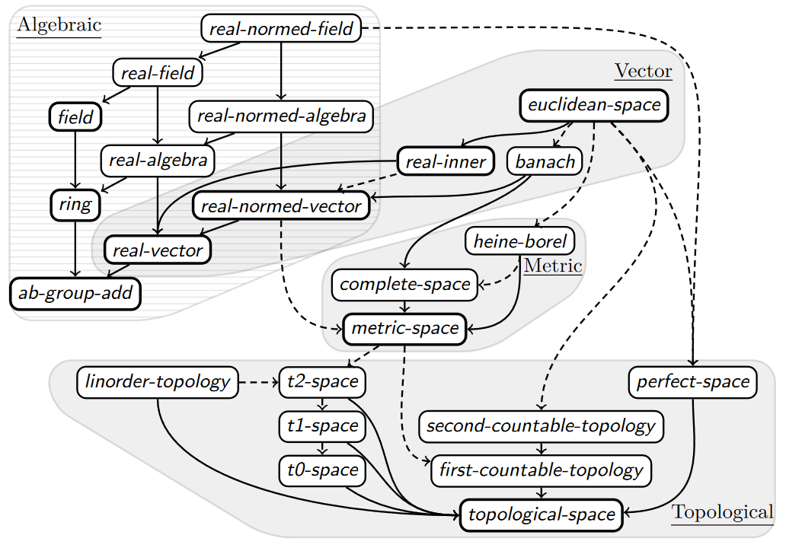

# Topology

This chapter follows the book [Topology without tears by Sydney A. Morris](https://www.topologywithouttears.net/). It builds upon and extends the
formalism in
[Grothendieck's Schemes in Algebraic Geometry](https://www.isa-afp.org/entries/Grothendieck_Schemes.html#), which in turn builds upon [A Case Study in Basic Algebra](https://www.isa-afp.org/entries/Jacobson_Basic_Algebra.html). You can import it from AFP (see \@ref(afp))


## Motivation and the big idea

What is topology and why do you need it?
The goal of topology is to generalize the definition of a continuity.
The most well known example of continuous functions are real functions 
whose limit approaches the function value `y` at any given point `x`.
Intuitively we think of continuous functions as any functions whose graph you can draw
without taking the pen off the paper. The problem with relying on intuition is that here any many 
functions that look continuous but aren't. For example `sin(1/x)` is not continuous
while [weierstrass function](https://en.wikipedia.org/wiki/Weierstrass_function) is.


For us topology is an important tool that will make
real analysis much easier to work with in Isabelle.
We will also see that continuity arises in many places where 
we wouldn't expect it. For example it is possible to take
[derivatives of types](https://codewords.recurse.com/issues/three/algebra-and-calculus-of-algebraic-data-types).


The main idea is to observe that if function is 

TODO: add visual intuition behind continuity expressed with open sets/neighborhoods/filters.

Topology is one of the paths to mathematical analysis. There is also an alternative path that
uses abstract algebra. This is nicely summarized by Isabelle's type class hierarchy (graphic comes from [this paper](https://www.cs.vu.nl/~jhl890/pub/hoelzl2013typeclasses.pdf))



## Topological spaces

### Topology {#topological-space-def}

We define topological space as a type `'a` (or meta set \@ref(abstraction-and-representation)) equipped with `open` predicate that tells us whether any `'a set` (subset of `'a`) is *open*. The term *open set* was invented as a generalization of [open intervals](https://en.wikipedia.org/wiki/Interval_(mathematics)). In the space (a.k.a type) of real numbers (`'a=real`) all sets of the form `(a,b)={x∈ℝ | a < x < b}` are open intervals.
<details>
  <summary>Note</summary>
  Brackets `(a,b)={x∈ℝ | a < x < b}` are a mathematical notation of open intervals. Actual Isabelle notation would be 
```
definition greaterThanLessThan :: "'a => 'a => 'a set"  ("(1{_<..<_})") where
  "{l<..<u} == {l<..} Int {..<u}"

```
  defined in [Set_Interval](https://isabelle.in.tum.de/library/HOL/HOL/Set_Interval.html) and [Real](https://isabelle.in.tum.de/library/HOL/HOL/Real.html). You need to import them if you want to experiment
```
theory Test
  imports Main HOL.Real 
begin
value "x::real" (* "x" *)
value "{2..(4::nat)}" (* "{2, 3, 4}" *)
value "{2..(4::real)}" (* error! *)
end
```
To see why the error in last `value`, check out the hidden note under \@ref(instantiating-lattice-on-bool).  
</details>
 In general `'a` open sets could be anything (for example sets of infinite strings with common prefixes are open in [Martin-Löf–Chaitin randomness](https://en.wikipedia.org/wiki/Algorithmically_random_sequence) which is the foundation of information theory and [Kolmogorov complexity](https://en.wikipedia.org/wiki/Kolmogorov_complexity)).


Topological space also has three axioms.
```
class "open" =
  fixes "open" :: "'a set ⇒ bool"
  
class topological_space = "open" +
  assumes open_UNIV [simp, intro]: "open UNIV"
  assumes open_Int [intro]: "open S ⟹ open T ⟹ open (S ∩ T)"
  assumes open_Union [intro]: "∀S∈K. open S ⟹ open (⋃K)"
```

In topology textbooks you will see the symbol τ (tau) denoting `τ={S . open S}` the set of open sets and notation *S ∈ τ* instead of `open S`.
Typically a mathematician would say that `UNIV` and `{}` must be open but in Isabelle we have `open_UNIV` axiom
which only says that `UNIV` is open. The openness of `{}` follows from axiom `open_Union` when `K={}`.

```
lemma open_empty [continuous_intros, intro, simp]: "open {}"
  using open_Union [of "{}"] by simp
```

<details>
<summary>More detailed proof</summary>

The notation `open_Union [of "{}"]` is equivalent to creating a new auxiliary lemma `open_Union_trivial`.
```
lemma (in topological_space) open_Union_trivial: "∀S∈{}. open S ⟹ open {}"
  apply(simp)
  done
lemma (in topological_space) open_empty : "open {}" 
  apply(rule open_Union_trivial) (* goal becomes:  "Ball {} open" *)
  apply(rule ballI) (* new goal: "⋀S. S ∈ {} ⟹ open S" *)
  apply(simp)
  done
```
We added `(in topological_space)` because this proof (and many of other below) only holds in the context of this type class. You can also use `context` keyword (\@ref(lattices-in-isabelle)).

</details>
The notation `⋃K` stands for an infinite union of all sets `S` 
that are members of `K`. The axiom `open_Union` states that if all sets `S` are open (`∀S∈K. open S`)
then their union must be open too (`open (⋃K)"`).

If we can take unions over infinite sets, then clearly we can
take finite unions.
```
lemma open_Un [continuous_intros, intro]: "open S ⟹ open T ⟹ open (S ∪ T)"
  using open_Union [of "{S, T}"] by simp
```

The axiom `open_Int` only allows us to take intersections of two open sets. This means 
that we can take intersections over `finite` sets.

```
lemma open_Inter [continuous_intros, intro]: "finite S ⟹ ∀T∈S. open T ⟹ open (⋂S)"
  by (induction set: finite) auto
```

An infinite intersection of open sets is **not** guaranteed to be open.

If for all `x ∈ S` there exists some open subset `T ⊆ S` containing `x ∈ T` then `S` must be open.

```
lemma openI:
  assumes "⋀x. x ∈ S ⟹ ∃T. open T ∧ x ∈ T ∧ T ⊆ S"
  shows "open S"
proof -
  have "open (⋃{T. open T ∧ T ⊆ S})" by auto
  moreover have "⋃{T. open T ∧ T ⊆ S} = S" by (auto dest!: assms)
  ultimately show "open S" by simp
qed
```

This holds true because we could take union of all `T`s. The union of `T`s must be open and equal `S`.
Therefore `S` must be open.

#### Discrete topology


Discrete topology is a special case of topological space in which all subsets `'a set` are open

```
class discrete_topology = topological_space +
  assumes open_discrete: "⋀A. open A"
```

<details>
<summary> Mind the context! </summary>
While all the theorems above live in 
```
context topological_space
begin
...
end
```
discrete topology is defined outside of it.
</details>

Try to prove that if all singleton sets are open then the space is discrete

```
lemma (in topological_space) singl_open_discr : "∀ x::'a . open {x} ⟹ ∀s::'a set . open s"
```


### Open, closed, clopen sets

We define a set to be `closed` if and only if (`⟷`) its complement (`-S`) is open

```
definition closed :: "'a set ⇒ bool"
  where "closed S ⟷ open (- S)"
```

<details>
<summary> Mind the context! </summary>
All theorems in this section as well as definition of `closed` live in 
`topological_space` context.
```
context topological_space
begin
...
end
```
</details>

The empty `{}` and full `UNIV` sets are closed

```
lemma closed_empty [continuous_intros, intro, simp]: "closed {}"
  unfolding closed_def by simp
  
lemma closed_UNIV [continuous_intros, intro, simp]: "closed UNIV"
  unfolding closed_def by simp
```

Sets that are both closed and open are called *clopen* 
<details>
  <summary>Note</summary>
By finding clopen sets it is possible
to detect disconnected components, which you can intuitively think of like "cracks" in the space. 
If `{}` and `UNIV` are the only clopen sets, then there are no "cracks".
</details>

A union and intersection of closed sets is closed

```
lemma closed_Un [continuous_intros, intro]: "closed S ⟹ closed T ⟹ closed (S ∪ T)"
  unfolding closed_def by auto

lemma closed_Int [continuous_intros, intro]: "closed S ⟹ closed T ⟹ closed (S ∩ T)"
  unfolding closed_def by auto
```

Infinite intersection is closed too

```
lemma closed_Inter [continuous_intros, intro]: "∀S∈K. closed S ⟹ closed (⋂K)"
  unfolding closed_def uminus_Inf by auto
```

You may notice at this point that everything that holds for open sets should
also hold for closed sets after swapping unions with intersections. This simply follows
from [De Morgan's law](https://en.wikipedia.org/wiki/De_Morgan%27s_laws).

Difference of open and closed set is open

```
lemma open_Diff [continuous_intros, intro]: "open S ⟹ closed T ⟹ open (S - T)"
  by (simp add: closed_open Diff_eq open_Int)

lemma closed_Diff [continuous_intros, intro]: "closed S ⟹ open T ⟹ closed (S - T)"
  by (simp add: open_closed Diff_eq closed_Int)
```


### Basis

Topological space can be generated by a basis `S` which is a set of subsets `'a set set`.

```
inductive generate_topology :: "'a set set ⇒ 'a set ⇒ bool" for S :: "'a set set"
  where
    UNIV: "generate_topology S UNIV"
  | Int: "generate_topology S (a ∩ b)" if "generate_topology S a" and "generate_topology S b"
  | UN: "generate_topology S (⋃K)" if "(⋀k. k ∈ K ⟹ generate_topology S k)"
  | Basis: "generate_topology S s" if "s ∈ S"
```

Defining `open = generate_topology B` would mean that open sets are inductively defined, that is,
all sets in `B` are open (`Basis`) and `UNIV` is open and any union ('UN') and intersection ('Int') of open sets is open. The proof that `generate_topology` indeed yields a topological space is given as follows.

```
lemma topological_space_generate_topology: "class.topological_space (generate_topology S)"
  by standard (auto intro: generate_topology.intros)
```

An example of generated topology is the `order_topology` in the next section.

## Order and separation

### Order topology

Every set equipped with `order` (\@ref(order-type-classes)) can be easily turned into a topological space
by assuming `open_generated_order`.

```
class order_topology = order + "open" +
  assumes open_generated_order: "open = generate_topology (range (λa. {..< a}) ∪ range (λa. {a <..}))"
```

This is sometimes called a [natural topology](https://en.wikipedia.org/wiki/Natural_topology). On a real line,
this would mean that all half-open intervals are open sets and any union or intersection of open intervals is an open set too. This includes all open intervals because an intersection of two half-open intervals `{..< a}` and `{b <..}` yields an open interval `{b <..< a}`.
<details>
<summary>Recall the meaning of this notation</summary>

```
definition lessThan    :: "'a => 'a set" ("(1{..<_})") where
  "{..<u} == {x. x < u}"

definition atMost      :: "'a => 'a set" ("(1{.._})") where
  "{..u} == {x. x ≤ u}"

definition greaterThan :: "'a => 'a set" ("(1{_<..})") where
  "{l<..} == {x. l<x}"

definition atLeast     :: "'a => 'a set" ("(1{_..})") where
  "{l..} == {x. l≤x}"
  
definition greaterThanLessThan :: "'a => 'a => 'a set"  ("(1{_<..<_})") where
  "{l<..<u} == {l<..} Int {..<u}"

definition atLeastLessThan :: "'a => 'a => 'a set"      ("(1{_..<_})") where
  "{l..<u} == {l..} Int {..<u}"

definition greaterThanAtMost :: "'a => 'a => 'a set"    ("(1{_<.._})") where
  "{l<..u} == {l<..} Int {..u}"

definition atLeastAtMost :: "'a => 'a => 'a set"        ("(1{_.._})") where
  "{l..u} == {l..} Int {..u}"
```
</details>

We can use `subclass` keyword to tell Isabelle that every `order_topology` is a `topological_space`

```
class order_topology = order + "open" +
  assumes open_generated_order: "open = generate_topology (range (λa. {..< a}) ∪ range (λa. {a <..}))"
begin

subclass topological_space
  unfolding open_generated_order
  by (rule topological_space_generate_topology)
  
end
```


The simplest example of topological space is `bool` which is also a discrete topology

```
class discrete_topology = topological_space +
  assumes open_discrete: "⋀A. open A"

instance discrete_topology < t2_space
proof
  fix x y :: 'a
  assume "x ≠ y"
  then show "∃U V. open U ∧ open V ∧ x ∈ U ∧ y ∈ V ∧ U ∩ V = {}"
    by (intro exI[of _ "{_}"]) (auto intro!: open_discrete)
qed

instantiation bool :: linorder_topology
begin
```

A notable special case of `order_topology` is

```
class linorder_topology = linorder + order_topology
```

In `linorder_topology` the intervals `{..< a}` and `{a <..}` really are intervals. 
In `order_topology` with partial order, the sets `{a <..< b}` may instead look like [convex sublattices](https://en.wikipedia.org/wiki/Lattice_(order)) (when the topological space is also a lattice \@ref(lattices)).

### T0, T1 and T2 spaces

Topological spaces only tell us what operations can be performed on open sets but there are no axioms that 
would say anything about individual elements of those sets. Therefore, to obtain more interesting
properties it is necessary to include additional axioms relating elements and sets. These are called
*separation axioms*. 

The first one says that for any two distinct points `x` and `y` there
exists an open set containing one but not the other.

```
class t0_space = topological_space +
  assumes t0_space: "x ≠ y ⟹ ∃U. open U ∧ ¬ (x ∈ U ⟷ y ∈ U)"
```

This means that all points can be [topologically distinguishable](https://en.wikipedia.org/wiki/Topological_indistinguishability) from one another.
Intuitively you may think of it as if there were two points so close to each other that they seem to overlap but if you zoom in close enough then you will eventually spot two distinguished points. In spaces that are not `t0_space` you might zoom-in forever and the points would always "overlap" (at least from topological point of view).     

<iframe width="560" height="315" src="https://www.youtube.com/embed/jg91ikK0OCI" title="YouTube video player" frameborder="0" allow="accelerometer; autoplay; clipboard-write; encrypted-media; gyroscope; picture-in-picture; web-share" allowfullscreen></iframe>

 
Spaces that satisfy this axiom are called *T0 spaces* or *Kolmogorov spaces*. 

The next axiom characterizes  *T1* spaces

```
class t1_space = topological_space +
  assumes t1_space: "x ≠ y ⟹ ∃U. open U ∧ x ∈ U ∧ y ∉ U"
```

This axiom is nearly identical to T0 but now there must exist one open set containing `x` but not `y` **and** another one containing `y` but not `x` (if you replaced **and** with **or** then this would be the T0 axiom). Every T1 space is T0 but not every T0 is T1.

```
instance t1_space ⊆ t0_space (* every T1 space is T0 *)
  by standard (fast dest: t1_space)
```

The T1 spaces guarantee that every singleton set `{x}` must be closed because you can take the union of all
open sets not containing point `x`.

```

context t1_space begin

lemma separation_t1: "x ≠ y ⟷ (∃U. open U ∧ x ∈ U ∧ y ∉ U)"
  using t1_space[of x y] by blast

lemma closed_singleton [iff]: "closed {a}"
proof -
  let ?T = "⋃{S. open S ∧ a ∉ S}"
  have "open ?T"
    by (simp add: open_Union)
  also have "?T = - {a}"
    by (auto simp add: set_eq_iff separation_t1)
  finally show "closed {a}"
    by (simp only: closed_def)
qed

end
```

The axioms of T1 and T0 spaces are rather weak. It is at T2 where things start to get interesting.

```
class t2_space = topological_space +
  assumes hausdorff: "x ≠ y ⟹ ∃U V. open U ∧ open V ∧ x ∈ U ∧ y ∈ V ∧ U ∩ V = {}"
```

This axiom is similar to T1 but it additionally guarantees that the two open sets are disjoint. 
T2 spaces are commonly called *Hausdorff*. Every Hausdorff space is a T1 space.

```
instance t2_space ⊆ t1_space
  by standard (fast dest: hausdorff)

lemma (in t2_space) separation_t2: "x ≠ y ⟷ (∃U V. open U ∧ open V ∧ x ∈ U ∧ y ∈ V ∧ U ∩ V = {})"
  using hausdorff [of x y] by blast

lemma (in t0_space) separation_t0: "x ≠ y ⟷ (∃U. open U ∧ ¬ (x ∈ U ⟷ y ∈ U))"
  using t0_space [of x y] by blast
```


Observe that every discrete topology is T2.

```
instance discrete_topology < t2_space
proof
  fix x y :: 'a
  assume "x ≠ y"
  then show "∃U V. open U ∧ open V ∧ x ∈ U ∧ y ∈ V ∧ U ∩ V = {}"
    by (intro exI[of _ "{_}"]) (auto intro!: open_discrete)
qed
```


### Linear order and separation axioms

We can find many interesting relations between topologies with total order (`linorder_topology`) and the separation axioms that they satisfy.
First notice that these closed intervals are indeed closed sets.

```

lemma closed_atMost [continuous_intros, simp]: "closed {..a}"
  for a :: "'a::linorder_topology"
  by (simp add: closed_open)

lemma closed_atLeast [continuous_intros, simp]: "closed {a..}"
  for a :: "'a::linorder_topology"
  by (simp add: closed_open)

lemma closed_atLeastAtMost [continuous_intros, simp]: "closed {a..b}"
  for a b :: "'a::linorder_topology"
proof -
  have "{a .. b} = {a ..} ∩ {.. b}"
    by auto
  then show ?thesis
    by (simp add: closed_Int)
qed
```

This is because the complement of `{a .. }` is an open interval `{..< a}` and recall that `order_topology` is generated by

```
open = generate_topology (range (λa. {..< a}) ∪ range (λa. {a <..}))
```

In any *partially ordered* set we can show that for any two distinct points `x<y` there exist two open "cones"
`{b <..}` and `{..< a}` containing each of the points `x ∈ {..< a}` and `y ∈ {b <..}` but which
are disjoint `{..< a} ∩ {b <..} = {}`. The proof follows by considering cases when there exists `z`
between `x` and `y` or not. 

```
lemma (in order) less_separate:
  assumes "x < y"
  shows "∃a b. x ∈ {..< a} ∧ y ∈ {b <..} ∧ {..< a} ∩ {b <..} = {}"
proof (cases "∃z. x < z ∧ z < y")
  case True
  then obtain z where "x < z ∧ z < y" ..
  then have "x ∈ {..< z} ∧ y ∈ {z <..} ∧ {z <..} ∩ {..< z} = {}"
    by auto
  then show ?thesis by blast
next
  case False
  with ‹x < y› have "x ∈ {..< y}" "y ∈ {x <..}" "{x <..} ∩ {..< y} = {}"
    by auto
  then show ?thesis by blast
qed
```

This looks a lot like separation axiom of Hausdorff space. Indeed we have

```
instance linorder_topology ⊆ t2_space
proof
  fix x y :: 'a
  show "x ≠ y ⟹ ∃U V. open U ∧ open V ∧ x ∈ U ∧ y ∈ V ∧ U ∩ V = {}"
    using less_separate [of x y] less_separate [of y x]
    by (elim neqE; metis open_lessThan open_greaterThan Int_commute)
qed
```


### Instances of topologies


The `bool` type is the simplest example of a linearly-ordered topological space

```
instantiation bool :: linorder_topology
begin

definition open_bool :: "bool set ⇒ bool"
  where "open_bool = generate_topology (range (λa. {..< a}) ∪ range (λa. {a <..}))"

instance
  by standard (rule open_bool_def)

end
```

and it is also discrete

```
instance bool :: discrete_topology
proof
  fix A :: "bool set"
  have *: "{False <..} = {True}" "{..< True} = {False}"
    by auto
  have "A = UNIV ∨ A = {} ∨ A = {False <..} ∨ A = {..< True}"
    using subset_UNIV[of A] unfolding UNIV_bool * by blast
  then show "open A"
    by auto
qed

instantiation nat :: linorder_topology
begin
```

The same holds for `nat` and `int`. Textbooks such as "Topology without tears" have the
privilege of jumping straight to Euclidean topology on real numbers. For us reaching the definition of real numbers
requires a lot more involvement and preparation. First we would need to understand Cauchy sequences and before that we need to cover neighborhoods and limit points. For now all the topologies we can instantiate are discrete.


## Neighborhoods and filters

Isabelle defines topological spaces using `open` sets. There exist [several](https://math.stackexchange.com/questions/799732/neighborhood-vs-neighborhood-filter) 
equivalent definitions and one of them involves filters. Filters are not covered directly in "Topology without tears" (but are mentioned in the appendix). We have to cover them because they will make working with neighborhoods a lot easier.

### Filters 

Recall (\@ref(topological-space-def)) that `open:: 'a set ⇒ bool` was a predicate.
With set comprehension it could be turned into the set `{x . open x} :: 'a set set` of open subsets.
The distinction between set and predicate is blurry. Indeed, the axiomatization of `set` (\ref(set-def)) states
explicitly the one-to-one correspondence between sets and predicates. Therefore, the definition
of filter looks as follows.

```
locale is_filter =
  fixes F :: "('a ⇒ bool) ⇒ bool"
  assumes True: "F (λx. True)"
  assumes conj: "F (λx. P x) ⟹ F (λx. Q x) ⟹ F (λx. P x ∧ Q x)"
  assumes mono: "∀x. P x ⟶ Q x ⟹ F (λx. P x) ⟹ F (λx. Q x)"
```

This definition comes from old times before Isabelle had `set`.
<details>
<summary>Correspondence between sets and predicates</summary>
The type `'a ⇒ bool` is a predicate, which might as well be thought of as `'a set`.
Then `('a ⇒ bool) ⇒ bool` is 
like a set of subsets `'a set set`. Hence, filter `F` is a set of subsets of the topological space `'a` just like τ.
Unlike τ the axioms are different. The `conj` says that for any two sets `P` and `Q` belonging to `F`, their intersection is also in `F`. This axiom could have been equivalently written as

```
assumes conj: "P ∈ F ∧ Q ∈ F ⟹ Q ∩ P ∈ F"
```

The expression 
`F (λx. P x)` could be simplified to `F P` (using [eta reduction](https://wiki.haskell.org/Eta_conversion) of lambda calculus) and then reformulated using set notation `P ∈ F`. 

A similar reasoning allows us to rewrite `mono` into a more readable form

```
assumes mono: "P ⊆ Q ∧ P ∈ F ⟹ Q ∈ F"
```

The `(λx. True)` is the definition of the full set `UNIV`. 

```
assumes True: "UNIV ∈ F"
```
</details>
In modern Isabelle it could be written as follows.
```
locale `is_filter =
  fixes F :: "'a set set"
  assumes True: "UNIV ∈ F"
  assumes conj: "P ∈ F ∧ Q ∈ F ⟹ Q ∩ P ∈ F"
  assumes mono: "P ⊆ Q ∧ P ∈ F ⟹ Q ∈ F"
```

Fortunately the notation doesn't matter because the following `typedef` turns the `is_filter` predicate into a set. Then we don't need to use `is_filter` anymore.

```
typedef 'a filter = "{F :: ('a ⇒ bool) ⇒ bool. is_filter F}"
proof
  show "(λx. True) ∈ ?filter" by (auto intro: is_filter.intro)
qed
```


<details>
<summary>**Important note: proper vs improper filters**</summary>
The definition above is different from the one in "Topology without tears".
Usually mathematicians would use axiom `{} ∉ F` instead of `UNIV ∈ F`. A filter that contains `{}` is called
an *improper filter*. We can always assume `{} ∉ F` later on in proofs where it matters but there are also
many proofs that would apply even to improper filters. Therefore Isabelle's definition is more general and flexible than that in textbooks. Also note that the `True` axiom is necessary because without it, it would be possible to define `F P = False` for all `P` (or in set theoretic notation `F = {}`) and then the axioms `conj` and `mono` would hold [vacuously](https://en.wikipedia.org/wiki/Vacuous_truth). Lack of `True` would render most proofs impossible but if `{} ∉ F` was used in place of `True` then `UNIV ∈ F` would follow from `mono`.
</details>


### Eventually


