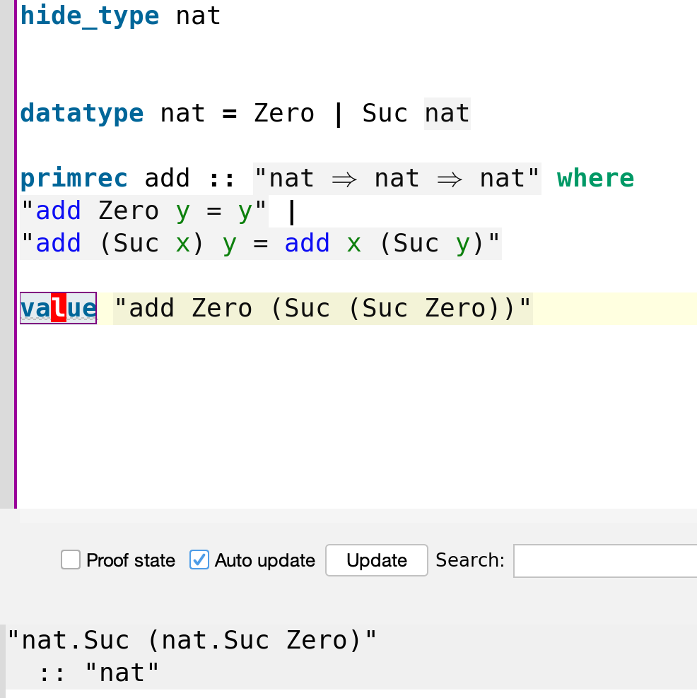
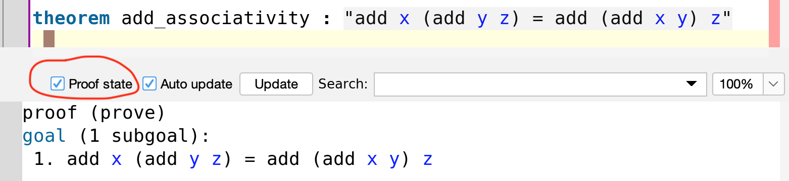

# Relearning mathematics using Isabelle 

This is a highly practical tutorial for Isabelle. There already exists plenty of excellent introductory material but I couldn't find any resource that would start from basics and gradually go into practical proofs and theories with clear connection to various fields of mathematics such as topology, algebra, analysis, probability. It's also a good way to get deeply familiar with the standard library. I wrote this tutorial as I was learning the materials myself. Hopefully it will help others save their time. It is for those we like to learn by doing and seeing lots of examples. The official resources are better suited for detailed and more theoretical treatment of Isabelle.

## Introduction and first steps

Let's start by creating a file `Playground.thy`
with the following contents

```
theory Playground
imports Main
begin
(* here we will write our code*)
end
```
We can use `(* *)` as comments. Those are ignored by Isabelle.

### Inductive data types

The set of natural numbers `nat` is defined inductively as

```
datatype nat = Zero | Suc nat
```

(This is not actual definition of `nat`)

We can represent `0` as `Zero`, number `1` as `Suc Zero`, number `2` as `Suc (Suc Zero)` and so on. This is widely known as [Peano arithmetic](https://en.wikipedia.org/wiki/Peano_axioms).  

### Functions

Functions can be defined usig `primrec `. For example addition can be introduced as the follows

```
primrec add :: "nat ⇒ nat ⇒ nat" where
"add Zero y = y" |
"add (Suc x) y = Suc (add x y)"
```
Isabelle uses `⇒` (written as `=>` in ASCII) to denote the type of functions. If `x` and `y` are types then `x ⇒ y` is a function type (`⇒` has [left associativity](https://en.wikipedia.org/wiki/Operator_associativity)). Such mathematical expressions must be enclosed in double quotes `" "`. After the type comes `where` keyword which marks the beginning of function **specification** (this is not function *definition*! You'll see later). Our function has two cases separated by `|`.
 The first case applies when the first argument is `Zero`. You can test it with the `value` command, for example `0+2` is

```
value "add Zero (Suc (Suc Zero))"
```


The second case applies when the first argument is a successor `Suc x` of some number `x`. For example `1+2` outputs `3` as follows

```
value "add (Suc Zero) (Suc (Suc Zero))" (* this prints "nat.Suc (nat.Suc (nat.Suc Zero))" *)
```


The functions `Zero` and `Suc` are called constructors. Their types are `nat`and `nat ⇒ nat` which you can check using `value`

```
value "Suc" (* this prints "nat ⇒ nat" *)
value "Zero" (* and this prints "nat" *)
```
All inductive types (`datatype`) have some size. The `size` tells us how deep the recursion is. For example

```
value "size Zero"  (* prints "0" *)
value "size (Suc Zero)" (* prints "1" *)
value "size (Suc (Suc Zero))" (* prints "2" *)
```
A constructor can take more than one argument   

```

datatype x = X1 | X2 x | X3 x x

value "size X1" (* prints "0" *)
value "size (X2 X1)" (* prints "1" *)
value "size (X3 X1 X1)" (* still prints "1" *)
value "size (X3 X1 (X2 X1))" (* now prints "2" *)

```
The value of `size` is always a finite number, which brings us to 
primitive recursion. 

### Primitive recursion

In Isabelle all functions must terminate. For example the following is illegal
```
primrec f :: "nat ⇒ nat" where
"f x = f x"
```
because the evaluation of `f` would never end. The reason why we don't want that is because it would allow us to prove any statement about `f` to be true (proofs by induction will be shown soon). 

To avoid such problems `primrec` must be a [primitive recursive function](https://en.wikipedia.org/wiki/Primitive_recursive_function). Those functions must be of the form

```
datatype x = X1 a | X2 b | ... Xn c
primrec f :: "x ⇒ y" where
"f (X1 a) = ... f a ..." |
"f (X2 b) = ... f b ..." |
... |
"f (Xn c) = ... f c ..." 
```
which means that they consider all cases (`X1 a`, `X1 b`, ... `Xn c`) of some inductive type `x` and can only perform recursion (e.g. `f a`) on constructor parameters but not on the original input (e.g. `f (X1 a)` not allowed on the right side). This means that the `size` of first argument always decreases and because it is finite and non-negative it must eventually reach `0` and end. 

Primitive recursive functions are very limiting and not [Turing-complete](https://en.wikipedia.org/wiki/Turing_completeness), therefore, if `primrec` is not enough, we can use `fun` but we may have to provide our own proof that the recursion  always ends (`fun` will be shown later).

### Theorems and proofs

To write proofs we can use `theorem` keyword. For example let's write proof that addition is associative, that is, `x+(y+z)=(x+y)+z` for all natural numers `x,y,z`

```
theorem add_associativity : "add x (add y z) = add (add x y) z" 
```
If you place your cursor below the theorem and toggle the "Proof state" button you will see the state of your proof



When dealing with inductive types a good idea is to prove theorems by induction. This is done with `apply(induct_tac x)` tactic.

```
theorem add_associativity : "add x (add y z) = add (add x y) z" 
  apply(induct_tac x)
```
Now the state of the proof becomes

```
proof (prove)
goal (2 subgoals):
 1. add Zero (add y z) = add (add Zero y) z
 2. ⋀x. add x (add y z) = add (add x y) z ⟹
         add (nat.Suc x) (add y z) = add (add (nat.Suc x) y) z
```
We have two subgoals. First one is to prove that initial condition for `Zero`, second is to prove recursive case while having access to  inductive hypothesis `add x (add y z) = add (add x y) z`. The long double arrow `⟹` (written `==>` in ASCII) is the logical implication.
Symbol `⋀` is the universal quantifier "for all x". The goals we have now could be simplified. Isabelle can do a lot of the leg work automatically by using `apply(auto)` tactic.

```
theorem add_associativity : "add x (add y z) = add (add x y) z" 
  apply(induct_tac x)
   apply(auto)
  done
```
Now all the goals are proved

```
proof (prove)
goal:
No subgoals!
```
and we can add `done` to finish the theorem. 

### More complex proofs

Here are a few more examples of easy theorems

```
theorem add_suc_rev : " add x (Suc y) = add (Suc x) y" 
  by(induct_tac x, auto)
  
theorem add_suc_out : "add (Suc x) y = Suc (add x y)" 
  by(induct_tac x, auto)
  
theorem add_zero : "add x Zero = x" 
  by(induct_tac x, auto)
```

The `by` keyword  is a shorthand one-line notation for simple proofs and is equivalent to the multi-line proof we did before. Let's try a more complex theorem.

```
theorem add_commutativity : "add x y = add y x" 
  apply(induct_tac x)
  	apply(simp)
```
We start with induction and simplification but it only gets us so far

```
proof (prove)
goal (2 subgoals):
 1. y = add y Zero
 2. ⋀x. add x y = add y x ⟹ nat.Suc (add y x) = add y (nat.Suc x)
```
We have alreayd proved the first subgoal in form of `add_zero` theorem. We can tell Isabelle to use it by using `simp add: add_zero`.

```
theorem add_commutativity : "add x y = add y x" 
  apply(induct_tac x)
   apply(simp add:add_zero)
```
This solves the first subgoal

```
proof (prove)
goal (1 subgoal):
 1. ⋀x. add x y = add y x ⟹ add (nat.Suc x) y = add y (nat.Suc x)
```

The tactic `simp` is similar to `auto` but it only applies to a single subgoal and can be extended in many ways (like with `add:`) that `auto` cannot. `auto` uses more heuristics and can solve more problems out-of-the-box. `simp` gives more control to us. Now, to solve the remaining subgoal, not even `simp` is detailed enough. We will have to tell Isabelle which substitution rules to use exactly (`simp` and `auto` do this behind the scenes). We want to apply `apply(subst add_suc_rev)`

```
proof (prove)
goal (1 subgoal):
 1. ⋀x. add x y = add y x ⟹ add (nat.Suc x) y = add (nat.Suc y) x
```

and then `apply(subst add_suc_out)`

```
proof (prove)
goal (1 subgoal):
 1. ⋀x. add x y = add y x ⟹ nat.Suc (add x y) = add (nat.Suc y) x
```

and again `apply(subst add_suc_out)`

```
proof (prove)
goal (1 subgoal):
 1. ⋀x. add x y = add y x ⟹ nat.Suc (add x y) = nat.Suc (add y x)
```

then we finish off with `apply(simp)`. The full proof looks as follows

```
theorem add_commutativity : "add x y = add y x" 
  apply(induct_tac x)
   apply(simp add:add_zero)
  apply(subst add_suc_rev)
  apply(subst add_suc_out)
  apply(subst add_suc_out)
  apply(simp)
  done
```

##### The thinking process 
You might be wondering how I arrived at this proof. In fact, I started from the end. My initial goal was to prove `add_commutativity` but I coudln't. Whenever you're stuck in Isabelle, it's always a good idea to backtrack and try to prove something simpler first. I tried proving all the smaller auxiliary theorems like `add_suc_out` first. Even those were difficult because initially my definition of `add` looked like this

```
primrec add :: "nat ⇒ nat ⇒ nat" where
"add Zero y = y" |
"add (Suc x) y = add x (Suc y)" (* Suc applied to y! *)
```
Only after changing the definition to `Suc (add x y)` all of the theorems became much easier to prove. This is something you will see often when working with Isabelle or any other proof assistant. There are many equivalent definitions but some are more elegant than others.

### Inductive predicates

Data types are limited to representing finite entities. For example we can use `lists` to store a finite number of even numbers

```
value "[0::Nat.nat,2,4,6]"
(* it prints
"[0, 2, 4, 6]"
  :: "Nat.nat list"  <- notice Nat.nat comes from the imported Main. It's not our own definition.
*)
```
In many programming languages we can also use hash-maps to do something like

```
# This is Python code
is_even = {
 0 : True,
 1 : False,
 2 : True,
 3 : False,
 4 : True
}
```

The problem with data types is that they cannot store infinite sets. We could turn the hash-map `is_even` into a function instead

```
datatype nat = Zero | Suc nat 

fun is_even :: "nat ⇒ bool" where 
"is_even Zero = True" |
"is_even (Suc Zero) = False" |
"is_even (Suc(Suc n)) = is_even n"
```

Now calling `is_even (Suc (Suc Zero))` is equivalent to looking up a hash-map in Python `is_even[2]` but we are no longer limited to finite sets. Notice that we had to use `fun` because `primrec` does not allow nested patterns `is_even (Suc(Suc n))` on the left. We will investigate `fun` in depth later.

So functions are like infinite hash-maps. What about lists? We could imagine that their infinite analogue are `inductive` predicates

```
inductive Even :: "nat ⇒ bool" where
zero: "Even Zero"
| double: "Even (Suc (Suc n))" if "Even n" for n
```

While `is_even` returns `True` on numbers that are even and `False` on those that aren't, the `inductive` predicate `Even` can be proved to hold for even numbers but cannot be proved to hold for anything else. By analogy a list only contains elements that belong to it whereas a hash-map must also hold odd numbers (and mark them as `False`).

To prove that `4` is even we can proceed as follows

```
theorem "Even (Suc (Suc (Suc (Suc Zero))))"
  apply(rule double)
  apply(rule double)
  apply(rule zero)
  done
```

We can also prove that `is_even x` is true only when `Even x` holds 

```
theorem "Even m ⟹ is_even m" 
  apply(induction rule: Even.induct)
  by(simp_all)
```
The long arrow `⟹` is logical implication (written `==>` in ASCII).

The tactic `apply(induction rule: Even.induct)` says that we want to prove the theorem by induction and yields the following two subgoals. 

```
 1. is_even Zero
 2. ⋀n. Even n ⟹ is_even n ⟹ is_even (nat.Suc (nat.Suc n))
```

Those are then easy to prove using `apply(rule double)` and `apply(rule zero)` so we just let Isabelle do the rest automatically by calling `by(simp_all)`. 

##### Final remarks

If you need to prove statements about the negative cases (here those would be odd numbers) then working with recursive functions is easier.
On the other hand if you do not care about negative cases and only want to prove statements about positive ones (even numbers) then `inductive` definitions often yeild simpler proofs. 

In some cases it is impossible to give recursive definitions. In particular those are problems that are [not decidable](https://en.wikipedia.org/wiki/Decidability). Then our only option is to use `inductive` definitions (which is related to [semi-decidability](https://en.wikipedia.org/wiki/Decidability_(logic)#Semidecidability)).

### Type declarations, axiomatization 

#### Sets

We can declare a new type without providing any definition. This is done with `typedecl` keyword. Of course such types are not very useful on their own so they are typically combined with some `axiomatization`. For example the following is how Isabelle defines sets

```
typedecl 'a set

axiomatization Collect :: "('a ⇒ bool) ⇒ 'a set" ― ‹comprehension›
  and member :: "'a ⇒ 'a set ⇒ bool" ― ‹membership›
  where mem_Collect_eq [iff, code_unfold]: "member a (Collect P) = P a"
    and Collect_mem_eq [simp]: "Collect (λx. member x A) = A"
```

The apostrophe in front of `'a` is a special notation that indicates that `a` is not any specific type. Instead `'a` can be substituted for any other concrete type. It works like a wildcard or like generic types in many programming languages.

We do not know anything about `'a set` other than that it can be created with function `Collect` and that its members can be queried with `member`. We know that those two functions are "inverse" of each other which more precisely expressed by axioms `mem_Collect_eq` and `Collect_mem_eq`. We can use those two facts like we would use any other theorem. Axioms are theorems that we assume to be true without giving any proofs. We also do not need to provide definitions for `Collect` and `member`. They are like "interface" functions in some programming languages.

We introduce notation 

```
notation
  member  ("'(∈')") and
  member  ("(_/ ∈ _)" [51, 51] 50)
```

so that we can write `x ∈ X` instead of `member x X`. There is also nice syntax for set comprehension

```
syntax
  "_Coll" :: "pttrn ⇒ bool ⇒ 'a set"    ("(1{_./ _})")
translations
  "{x. P}" ⇌ "CONST Collect (λx. P)"
```

so that we can write `{x . P x}` instead of `Collect P` for some predicate `P`. We will investigate `syntax` and `notation` later. Their only purpose is to make things more readable.


#### Ordinals

The previous definition of natural numbers `nat` was simplified. The one actually provided by Isabelle is more complicated. Before we can see it we have to first declare `ind` but instead of definining it, we only state its axioms

```
typedecl ind

axiomatization Zero_Rep :: ind and Suc_Rep :: "ind ⇒ ind"
  ― ‹The axiom of infinity in 2 parts:›
  where Suc_Rep_inject: "Suc_Rep x = Suc_Rep y ⟹ x = y"
    and Suc_Rep_not_Zero_Rep: "Suc_Rep x ≠ Zero_Rep"

```

Notice that `ind` behaves just like `nat` but unlike `Suc`, the `Suc_Rep_inject` might be applied infinitely. It is possible to use `ind` to express infinity `∞` but `nat` could never do that (due to `size`).

Nonetheless, most of the time we **want** to work with finite numbers. For this purpose we define predicate `Nat` that includes only finite elements of `ind`

```
inductive Nat :: "ind ⇒ bool"
  where
    Zero_RepI: "Nat Zero_Rep"
  | Suc_RepI: "Nat i ⟹ Nat (Suc_Rep i)"
```


Now the real definition of `nat` is a subset of `ind set` that consists of only finite numbers `Nat`. 

```
typedef nat = "{n. Nat n}"
  morphisms Rep_Nat Abs_Nat
  using Nat.Zero_RepI by auto
```
Infinite numbers, known as [ordinals](https://en.wikipedia.org/wiki/Ordinal_number), will be covered later. The meaning of `morphisms` will be explained soon but it's not important at this point.


#### All types are inhabited

Another important example of an axiom is

```
axiomatization undefined :: 'a
```
Other proof assistants such as Coq, Agda, Lean, etc. are based on constructive logic and in particular homotopy type theory. In those logics it is possible for a type to be empty. It is usually known as `False` or `Void` and it used to express negation. 

Isabelle is based on higher-order-logic. It can use law of excluded middle and negation out-of-the-box. As empty types are not needed anymore, Isabelle is free to assume axioms such as `undefined`. It states that every type `'a` has some inhabitant. Note that `'` is used to indicate a type variable, which we can substitue for any concrete type like `undefined::nat`.

This axiom allows us to prove things like


```
datatype bool = True | False

lemma "undefined = True ∨ undefined = False" 
  apply(case_tac "undefined::bool") 
  apply(rule disjI1)
  apply(simp)
  apply(rule disjI2)
  apply(simp)
  done
```

The tactic `apply(case_tac "undefined::bool")` tries to consider all possible cases in which something of type `bool` could be defined. `undefined` must be either `undefined = bool.True` or `undefined = bool.False`, and in both of those cases the theorem should hold. Hence, we have two subgoals

```
 1. undefined = bool.True ⟹
    undefined = bool.True ∨ undefined = bool.False
 2. undefined = bool.False ⟹
    undefined = bool.True ∨ undefined = bool.False
```
The tactic `apply(rule disjI1)` is the first (`1`) introduction (`I`) rule for disjunction (`dist`). It says that if `P` is true then `P ∨ Q` is true. Analogically `apply(rule disjI2)` says that if `Q` is true then `P ∨ Q` is true. After applying `apply(rule disjI1)` we arrive at

```
 1. undefined = bool.True ⟹ undefined = bool.True
 2. undefined = bool.False ⟹
    undefined = bool.True ∨ undefined = bool.False
```
The equality in first subgoal is trivial so we can just use `apply(simp)` to automatically simplify it. We then proceed analogically with the second subgoal.

The `undefined` axiom has some major implications which will manifest themselves later. [Here](https://www.joachim-breitner.de/blog/732-Isabelle_functions__Always_total,_sometimes_undefined) is more on this topic as well.


### Basic set theory

```

lemma CollectI: "P a ⟹ a ∈ {x. P x}"
  by simp

lemma CollectD: "a ∈ {x. P x} ⟹ P a"
  by simp

lemma Collect_cong: "(⋀x. P x = Q x) ⟹ {x. P x} = {x. Q x}"
  by simp
```


```

abbreviation subset :: "'a set ⇒ 'a set ⇒ bool"
  where "subset ≡ less"

abbreviation subset_eq :: "'a set ⇒ 'a set ⇒ bool"
  where "subset_eq ≡ less_eq"

notation
  subset  ("'(⊂')") and
  subset  ("(_/ ⊂ _)" [51, 51] 50) and
  subset_eq  ("'(⊆')") and
  subset_eq  ("(_/ ⊆ _)" [51, 51] 50)

```


```

definition Ball :: "'a set ⇒ ('a ⇒ bool) ⇒ bool"
  where "Ball A P ⟷ (∀x. x ∈ A ⟶ P x)"   ― ‹bounded universal quantifiers›

definition Bex :: "'a set ⇒ ('a ⇒ bool) ⇒ bool"
  where "Bex A P ⟷ (∃x. x ∈ A ∧ P x)"   ― ‹bounded existential quantifiers›

```

```
definition id :: "'a ⇒ 'a"
  where "id = (λx. x)"
```

```
abbreviation inj :: "('a ⇒ 'b) ⇒ bool"
  where "inj f ≡ inj_on f UNIV"

abbreviation surj :: "('a ⇒ 'b) ⇒ bool"
  where "surj f ≡ range f = UNIV"

translations ― ‹The negated case:›
  "¬ CONST surj f" ↽ "CONST range f ≠ CONST UNIV"

abbreviation bij :: "('a ⇒ 'b) ⇒ bool"
  where "bij f ≡ bij_betw f UNIV UNIV"
```

